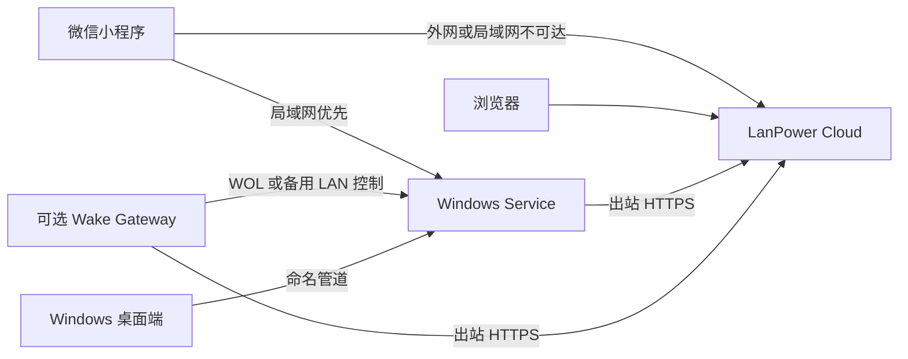
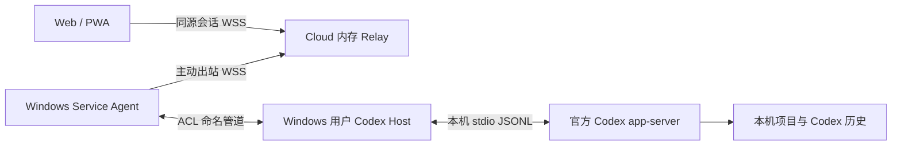

# LanPower 架构与实现状态

Cloud 是设备与账户平台；Windows 是可直接连接 Cloud 的设备；Wake Gateway 用于远程开机和可选备用控制。电源动作按目标 Windows 编号请求，由 Cloud 选择路径。1.8.0 新增独立 Codex Remote 链路，继续沿用现有身份和设备归属。

## 正式模式

Codex Remote 连接关系如下；Host 在当前交互用户下运行，Service 负责出站连接，两个进程都不新增 TCP 监听。Cloud 只转发正文，Codex 登录、会话历史与代码留在 Windows。

第一阶段每台电脑只有一个远程控制页面、一个用户 Host 和一个 Runtime。已发送任务在浏览器断线后继续运行；重连读取本机状态和历史，Relay 不回放任务正文。Cloud 使用单个 worker，重启丢弃转发队列。项目只能在电脑端授权，Runtime 按 `workspace-write` / `on-request` 启动；远端不能修改 Codex 配置、登录或调用任意 Shell RPC。具体能力与验收见 [Codex Remote](codex-remote.md)。

| 模式 | 组件 | 能力 |
|---|---|---|
| 无 Cloud | Windows + 小程序 | 独立 LAN 控制和局域网唤醒 |
| 无网关 | Windows + Cloud + 浏览器或小程序 | 在线电脑的状态、睡眠、休眠、重启、关机 |
| 无小程序 | Windows + Cloud + 浏览器 | 浏览器作为完整远程控制端 |
| 网关增强 | 上述组件 + Wake Gateway | 增加离线电脑唤醒；可按电脑开启备用控制 |

Windows 直连在线时优先 `windows_direct`。`wake` 只能显式选择，走 `wake_gateway`。Windows 直连离线、LAN 可达且两端启用备用控制时，才走 `gateway_relay`。发送结果未知时不自动换路径重复执行，也不会自动先唤醒再关机。

## 代码与数据

| 组件 | 实现 | 主要职责 |
|---|---|---|
| Windows | `windows/`，.NET 10、WPF、Windows Service | LAN API、Cloud Agent、DPAPI 凭据、命名管道、安装包 |
| Codex Host | `windows/LanPower.CodexHost/`，当前 Windows 用户 | 本地授权、app-server 生命周期、白名单 RPC、任务快照与受限审批 |
| Cloud | `cloud_app/`，FastAPI、SQLAlchemy、Alembic、Jinja2 | Passkey、恢复码、设备/客户端授权、命令路由、网页、审计 |
| 小程序 | `mini_program/pages/cloud/` | 独立客户端授权、多电脑选择、LAN First、Cloud Fallback |
| Gateway | `router_gateway/`，Go | 设备注册、多电脑配置、WOL、备用控制、防重复执行 |
| 部署 | `deploy/docker/` | Cloud、可选 Caddy、持久化数据、旧协议叠加配置 |
| 兼容层 | `source/`、`LanPower/`、`cloud_remote/`、小程序旧入口 | 保留旧 Python Windows、LAN API 和 `/api/v1/*` |

数据库以 `owner_id` 隔离资源；当前产品入口为单管理员，多用户公开注册尚未实现。Windows、网关和手机分别使用独立会话。网关与电脑通过 `device_links` 建立多对多关系。Windows 命令和网关命令分别排队，平台操作记录统一保存目标、动作、路径和结果。

## 阶段证据与剩余项

六个开发阶段均已有源码实现。2026-09-30 本地证据包括：Cloud 83 项测试、Windows 49 项单元测试及服务演练、6 项安装网卡选择检查、Go Linux 测试、ARM64 构建、网关安装/回滚模拟、微信逻辑模拟和浏览器桌面/手机布局。Cloud Docker、新数据卷权限、重启数据保留、本地 HTTPS 与隔离备份恢复也已通过。Windows 刷新恢复、连接管理、网络设置与监控、Wi-Fi/离线安装及更新检查已实现；实际 WPF 布局和物理网卡只读检查通过。详细证据见各组件说明。

最终文档核对补齐设备与客户端的授权失败审计，以及小程序版本展示和授权元信息，Cloud 最新全部 83 项测试通过；覆盖失效请求被拒绝后仍提交记录、重复事件合并、账户隔离、凭据不进入活动页面和旧客户端迁移保留。完整范围见 [开发与验收清单](implementation-checklist.md)。

随后已在用户指定环境部署：Cloudflare 公网入口、Caddy 正式证书、真实 Passkey 初始化、Windows 管理员首次安装及新版就地升级、无网关 `status` 回执、服务重启重连与凭据轮换通过。真实路由器已注册 v2 并关联本机电脑，网关在线且唤醒路径可用；监督程序在子进程退出后自动恢复并保留凭据，有网关时 `status` 仍由 Windows 直连完成。正式平台数据库副本在无网络、无公开端口的容器中恢复，身份和设备记录保留，`/setup` 保持关闭。部署私有信息不进入仓库。

Windows 安装生命周期继续通过实机检查：旧 Python 安装流程到新版 Setup 的迁移、便携包实际安装、Setup 卸载与重装均保留原 LAN 配对，Cloud 原授权可恢复。卸载后配置、加密凭据和命令记录哈希保持不变，日志保留；重装后的组件哈希与当前发布产物匹配。

Cloud 的恢复范围已扩展至平台数据库、Caddy 证书数据卷与配置卷：恢复出的证书和私钥在无外部网络、无公开端口的容器中提供可信 HTTPS，原域名和默认信任库校验通过；身份与设备记录保留，初始化保持关闭，生产容器未重启，临时资源已清理。

这些证据尚不足以宣布架构验收完成。仍需完成或核验：

- 整机启动与真实网络恢复；平台数据库、Caddy 证书和配置卷的隔离联合恢复已通过。
- 在管理员环境核验防火墙随地址变化、真实网络变化和 Wi-Fi 安装；首次安装的实际防火墙范围已核对。
- 微信扫码、存储和 Wi-Fi/5G 切换；用户已反馈开发者工具原生编译通过且无报错。
- 真实网关断网/整机重启恢复、多电脑 WOL 和备用控制；单电脑 v2 注册和关联已通过。
- **关闭 Router Gateway，在公网 Web 对在线 Windows 逐项核验 status、sleep、hibernate、restart、shutdown。** 无网关真实 `status` 已通过，四种电源动作的物理结果由用户手动验收。
- 真实 Passkey 重新登录、备用凭据和恢复码使用；已通过真实初始化不表示本机 Windows Hello 已配置。
- 远程 CI 与正式 Release 产物发布尚未执行；本轮仅本地提交。

四个要求的发布文件已本地生成；便携包白名单、组件与完整文件哈希、自包含服务运行及工作流静态检查通过。发布流程已配置为全部构建检查成功后再上传，详见 [构建与发布](releasing.md)。

Router Plugin、LAN 自动发现、其他操作系统设备、公开多用户和一次性本地 LAN 授权为原方案的后续扩展，不替代现有 LAN 兼容能力。

## 文档入口

[Windows 应用](windows-app.md) · [Cloud Direct](cloud-direct.md) · [Codex Remote](codex-remote.md) · [Cloud 部署](cloud-deployment.md) · [Wake Gateway](wake-gateway.md) · [认证](authentication-v2.md) · [小程序](mini-program-v2.md) · [旧版迁移](migration-v1.md) · [安全边界](security-model.md) · [故障排查](troubleshooting.md)
