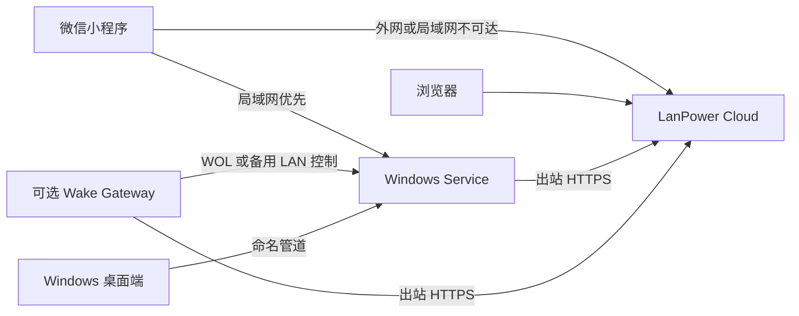

# LanPower 架构与实现状态

Cloud 是设备与账户平台；Windows 是可直接连接 Cloud 的设备；Wake Gateway 用于远程开机和可选备用控制。所有远程动作按目标 Windows 编号请求，由 Cloud 选择路径。

## 正式模式

| 模式 | 组件 | 能力 |
|---|---|---|
| 无 Cloud | Windows + 小程序 | 独立 LAN 控制和局域网唤醒 |
| 无网关 | Windows + Cloud + 浏览器或小程序 | 在线电脑的状态、睡眠、休眠、重启、关机 |
| 无小程序 | Windows + Cloud + 浏览器 | 浏览器作为完整远程控制端 |
| 网关增强 | 上述组件 + Wake Gateway | 增加离线电脑唤醒；可按电脑开启备用控制 |

Windows 直连在线时优先 `windows_direct`。`wake` 只能显式选择，走 `wake_gateway`。Windows 直连离线、LAN 可达且两端启用备用控制时，才走 `gateway_relay`。发送结果未知时不自动换路径重复执行，也不会自动先唤醒再关机。

## 代码与数据

| 组件 | 实现 | 主要职责 |
|---|---|---|
| Windows | `windows/`，.NET 10、WPF、Windows Service | LAN API、Cloud Agent、DPAPI 凭据、命名管道、安装包 |
| Cloud | `cloud_app/`，FastAPI、SQLAlchemy、Alembic、Jinja2 | Passkey、恢复码、设备/客户端授权、命令路由、网页、审计 |
| 小程序 | `mini_program/pages/cloud/` | 独立客户端授权、多电脑选择、LAN First、Cloud Fallback |
| Gateway | `router_gateway/`，Go | 设备注册、多电脑配置、WOL、备用控制、防重复执行 |
| 部署 | `deploy/docker/` | Cloud、可选 Caddy、持久化数据、旧协议叠加配置 |
| 兼容层 | `source/`、`LanPower/`、`cloud_remote/`、小程序旧入口 | 保留旧 Python Windows、LAN API 和 `/api/v1/*` |

数据库以 `owner_id` 隔离资源；当前产品入口为单管理员，多用户公开注册尚未实现。Windows、网关和手机分别使用独立会话。网关与电脑通过 `device_links` 建立多对多关系。Windows 命令和网关命令分别排队，平台操作记录统一保存目标、动作、路径和结果。

## 阶段证据与剩余项

六个开发阶段均已有源码实现。2026-09-30 本地证据包括：Cloud 66 项测试、Windows 26 项单元测试及服务演练、Go Linux 测试、ARM64 构建、网关安装/回滚模拟、微信逻辑模拟和浏览器桌面/手机布局。Cloud Docker 镜像构建、新数据卷权限、重启保留数据、Caddy 本地 HTTPS 与数据库备份恢复演练也已通过。Windows 刷新中断恢复、取消配对及断开 Cloud 已实现并验证。详细证据见各组件说明。

这些证据尚不足以宣布架构验收完成。仍需完成或核验：

- 实际公网域名下的自动证书申请、HTTPS 可达性和部署恢复。
- Windows 桌面的更新检查与高级设置体验。
- 动态网络变化后的地址、防火墙和配对信息更新；当前能检测旧地址失效，但不会自动改写防火墙。
- 安装包首次安装、旧版升级、卸载重装与便携分发包验收。
- 微信原生编译、扫码、存储和 Wi-Fi/5G 切换。
- 真实网关断网/重启恢复、多电脑 WOL 和备用控制。
- **关闭 Router Gateway，在公网 Web 对在线 Windows 逐项执行 status、sleep、hibernate、restart、shutdown。** 这是原架构的最终硬性验收，当前自动测试仅模拟电源动作。
- 远程 CI 与正式 Release 产物发布尚未执行；本轮仅本地提交。

Router Plugin、LAN 自动发现、其他操作系统设备、公开多用户和一次性本地 LAN 授权为原方案的后续扩展，不替代现有 LAN 兼容能力。

## 文档入口

[Windows 应用](windows-app.md) · [Cloud Direct](cloud-direct.md) · [Cloud 部署](cloud-deployment.md) · [Wake Gateway](wake-gateway.md) · [认证](authentication-v2.md) · [小程序](mini-program-v2.md) · [旧版迁移](migration-v1.md) · [安全边界](security-model.md) · [故障排查](troubleshooting.md)
