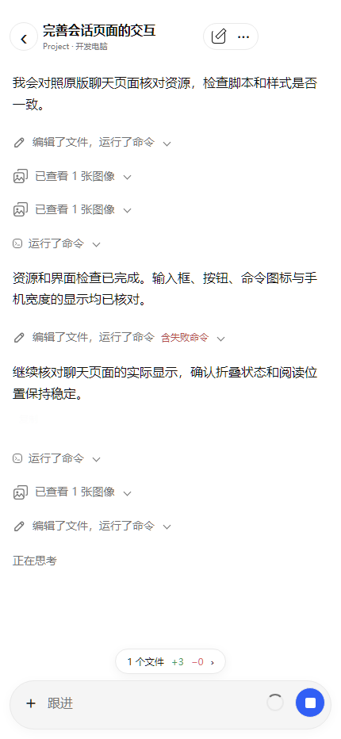
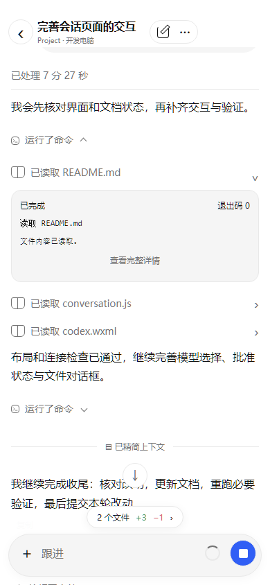
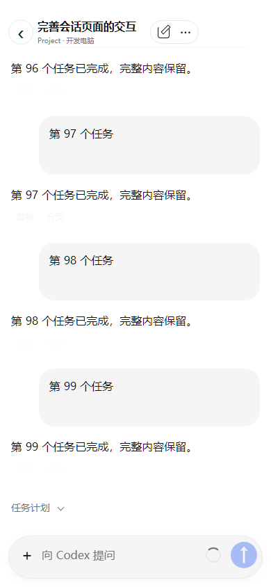

# 小程序会话滚动与云端组件对齐

2026-10-06：小程序 **3.6.4**，Windows / Cloud / Web **1.23.4**，协议仍为 **2**。

## 直接参考的云端源码

本次以现有云端聊天组件和用户提供的折叠截图为依据，没有另建一套展示规则：

- `remote_ui/src/lanpower/conversationPresentation.ts`：连续命令和文件修改分组、完成后的整轮过程收起、最终回复保留、分组状态提示。
- `remote_ui/src/components/content/ThreadActivitySummary.vue`：铅笔/终端图标、灰色摘要、失败提示和紧随文字的向下箭头。
- `remote_ui/src/components/content/ThreadImageActivity.vue`：叠放图片图标、查看/生成数量、默认收起、展开后读取图片。
- `remote_ui/src/components/content/ThreadWorkIndicator.vue`：公开思考摘要默认收起，展开显示 Markdown；没有公开摘要时不生成空折叠行。
- `remote_ui/src/components/content/ThreadConversation.vue`：向上增加渲染内容，展开时保留标题位置，复制/分支操作按每轮最后一个回复显示并淡出。

连续命令与文件修改统一显示“运行了命令”“编辑了文件”或“编辑了文件，运行了命令”；单条命令也采用相同的摘要入口。展开分组后可以逐条展开命令、输出、退出码和文件改动。说明文字、思考、图片、工具和轮次边界会中断分组。失败显示“含失败命令”，停止或拒绝显示相应提示。

图片查看与生成记录分别默认收起；展开后读取缩略图，点击进入微信原生多图预览。用户附件仍直接显示缩略图。折叠状态在同一聊天刷新中保留。思考仅来自原窗口公开摘要，不读取或显示私有推理。

## 滚动问题与修复

| 原因 | 修复 |
| --- | --- |
| 单次上滑位移不足 8px 时仍自动跟随 | 触摸开始暂停跟随；任何向上的滚动都停止拉到底部 |
| 前后窗口来回替换，定位产生底部事件后又读回后续页 | 上滑追加前面的内容并保留已有尾部；后续读取要求实际向下阅读 |
| 历史请求开始时保存位置，用户继续阅读后被旧位置拉回 | 请求结束、提交新视图之前读取当时的可见行位置，等待原生渲染完成再补偿 |
| 流式输出、图片加载和状态轮询重复更新整段正文 | 消息身份不变时仅更新变化的行，跳过相同状态 |
| 返回最新按钮占据布局高度；加载提示插入正文 | 返回最新按钮改为绝对定位，加载提示独立覆盖，不改变聊天高度 |
| 展开详情时重截取最新窗口 | 保留显示开头，沿用云端对点击标题的位置补偿；长过程完整原文继续保存在控制器 |

小程序继续按桥接载荷大小控制投影；达到载荷边界时，后续窗口只响应真实向下阅读并保留重叠内容。完整原始历史、长命令输出、文件 Diff 与公开摘要不因投影窗口删除，原来的全文读取和复制入口保留。

## 验证与使用

```powershell
node --test tests/test_mini_program_codex_conversation.js tests/test_mini_program_codex_ios.js tests/test_mini_program_codex_state.js
node tests/test_mini_program_codex_ios_layout.cjs
python scripts/verify-codex-web-assets.py --version 1.23.4
```

**61 项行为检查通过**，包括细小连续上滑、刷新期间触摸、上滑保留尾部、底部事件隔离、实际下滑追加、慢请求期间继续滚动、逐行刷新、单条/混合命令分组、图片/说明边界、折叠状态、会话隔离与完整原文保留。

WCC/WCSC 编译后的页面在 **320/390/430px** 验证折叠截图对应的摘要、图标和箭头位置，展开与历史追加的阅读位置误差不超过 **2px**，返回最新按钮不改变聊天区域高度；附件、模型与权限、键盘及深色检查通过。此验证使用虚构会话与合成图片，是浏览器适配检查；微信真机连续触摸、原生惯性滚动和公网 5G 仍需人工验收。

| 原版摘要行 | 展开命令 | 上滑保留内容 |
| --- | --- | --- |
|  |  |  |

连同首页和导航共 **84 项行为检查通过**，原生页面与连接传输检查通过；Cloud 版本兼容 **9 项通过**。网页整套资源哈希检查、版本一致性和公开文件检查通过。Windows 自包含安装器与 Docker 镜像构建成功。

导入完整 `mini_program`，或使用 `windows/out/CodexDock-mini-program-3.6.4.zip`，在微信开发者工具重新编译和预览。导入包的 63 个文件与本轮 Git 公共小程序树逐字节一致，使用公开占位 AppID，排除私有配置和授权。保留已有导航、账号、配对、权限、草稿与原 Codex 窗口。

本轮网页现有脚本与样式整套保留，资源哈希继续通过校验；Cloud / Windows 的版本同步用于本机更新。运行环境与保留检查见 [本机开发记录](local-development.md)。仅提交本地，不推送远程仓库或部署正式云端。
