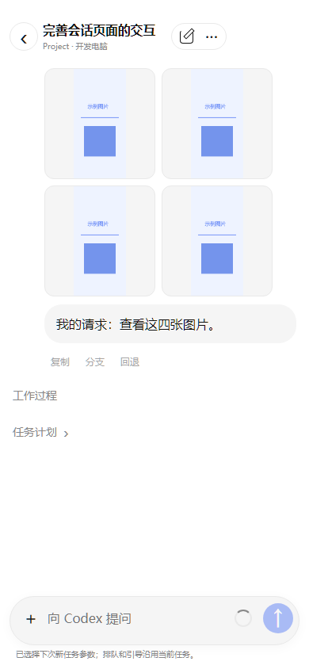
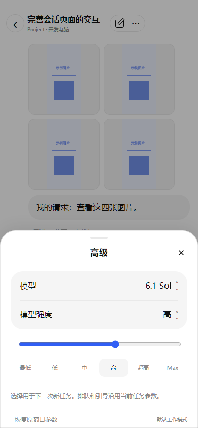
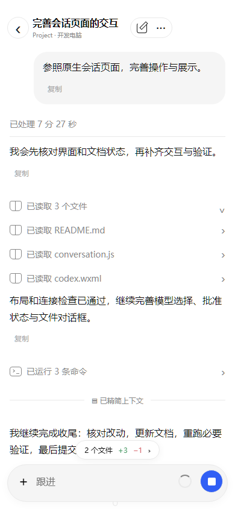

# 小程序会话阅读与图片修复

2026-10-05：小程序 **3.4.3**，Windows / Cloud / Web **1.22.4**。保留既有协议 2、配对、授权、电脑配置和会话内容。

## 本次调整

- 用户附件兼容桌面多行文件说明和旧版单行格式，支持 `My request` 与 `My request for Codex`。图片显示为等比例缩略图，普通文件保留引用；请求正文不再混入附件路径、文件说明或重复图片。点击缩略图调用微信原生大图预览，可缩放并切换同一条消息内的多图。
- 输入栏圆环打开模型选择面板。模型与档位来自电脑实际支持值，强度可滑动或点击选择；切换模型会修正不兼容的强度。选择用于下次新任务，排队和引导继续沿用当前任务参数。
- 展开工作过程、命令、文件、公开思考摘要或图片时固定标题与阅读位置，详情向下出现；长过程展开不再从末尾重新截取窗口。折叠时隐藏全文入口，展开后可查看完整命令、输出、文件 Diff 或公开摘要。
- 上滑到历史窗口边缘自动读取更早内容，下滑自动读取后续内容；移除“查看更早内容”“查看后续内容”和历史页中的手动后续按钮。保留重叠内容和像素位置，重复滚动不会同时读取同一页；切换聊天、电脑或断线后，迟到的旧页和定位不能覆盖新会话。
- 工作记录采用带箭头的折叠行，命令、文件修改、思考摘要和工作图片分别展开。完整原文留在控制器中，传给页面的窗口保持有界；只展示公开思考摘要，不传输私有推理。
- 文件改动数量与增删行数只显示为悬浮气泡，外层背景透明，正文可从气泡后方滚过。输入栏上方的模型和强度文字已移除，统一从圆环设置；输入栏尺寸变化时同步更新正文底部留白。

Windows Host 补齐从用户附件说明中登记图片来源，并在原生历史备用读取中保留结构化图片。项目外图片只允许所属会话读取，其他聊天、普通未附加文件和助手的普通文件说明不会获得相同授权；图片格式与路径校验继续生效。

## 验证与预览

```powershell
node --test tests/test_mini_program_codex_conversation.js tests/test_mini_program_codex_ios.js tests/test_mini_program_codex_state.js
node tests/test_mini_program_codex_ios_layout.cjs
```

小程序行为检查 **55 项通过**，覆盖附件解析与去重、公开摘要、长过程向下展开、自动历史加载、并发与迟到结果隔离、实际模型档位及图片失败重试。Windows Codex / 原生历史检查 **56 项通过**，包含同会话附件授权、跨会话隔离和结构化图片保留。网页类型检查、网页构建与 Windows 自包含安装器构建成功。

微信 WCC/WCSC 编译页面在 **320/390/430px** 检查布局，模拟滚动前后的标题/阅读位置误差不超过 **2px**；同时验证四张缩略图、大图入口、圆环滑块、透明气泡、键盘与深色。以下使用独立合成图片和虚构会话数据，属于编译后的浏览器适配预览，不是微信真机截图。

| 附件缩略图 | 圆环模型与强度 |
| --- | --- |
|  |  |



微信真机的连续触摸滚动、原生图片缩放/切换、键盘、安全区与 5G 仍需人工验收；本轮没有向 Codex 发送真实推理任务或执行电源动作。

导入包为 `windows/out/CodexDock-mini-program-3.4.3.zip`，使用公开占位 AppID，排除私有配置与授权；请重新编译或预览使用新版。构建与本机更新记录见 [本机开发](local-development.md)。本轮仅提交本地改动，不推送仓库、不发布远程资源、不部署正式云服务器。

导入包从隔离源码构建，包含已提交的 3.4.2 顶部导航修复和本次会话改动；55 个文件逐字节核对通过。其他尚未完成的账号和电脑页面改动不打入此包。

本轮曾就地更新 Windows / Docker 到 1.22.4，安装与数据保留检查通过。随后本机由账号任务更新到 1.23.0；为保留新版，已在其 Host 源码中加入本次两处图片修复并重新构建、安装 Host，保留 1.23.0 Service/Desktop 与用户设置，未降级整个应用。当前 Docker 也保留账号任务的 1.23.0 镜像及源码挂载。1.22.4 安装器仅作为本轮独立构建记录保留，不应覆盖当前 1.23.0 安装。

安装版 Host 的只读检查退出码 0，确认仍连接官方原窗口，项目/聊天列表、历史和队列读取可用。此检查没有发送任务、修改会话或抢占现有控制页面。
