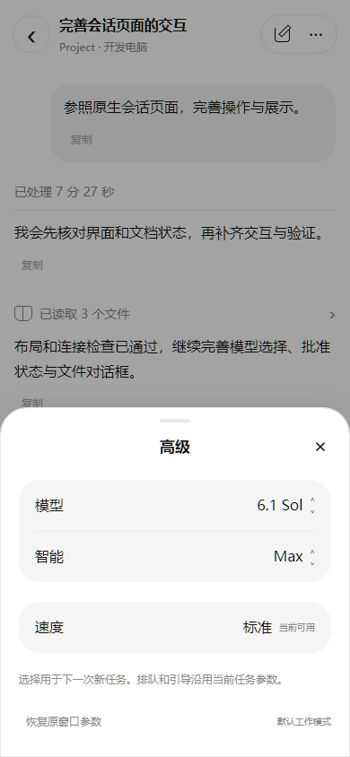
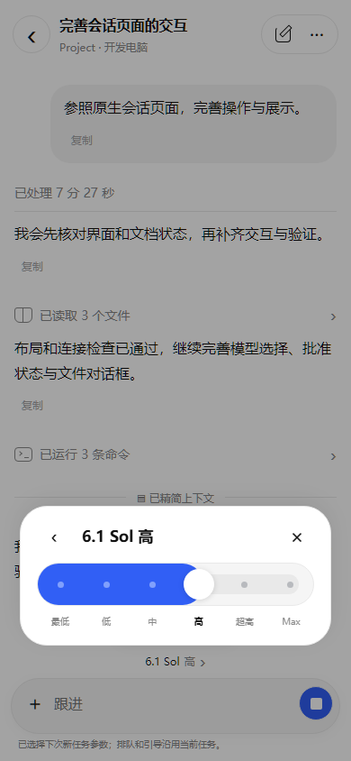
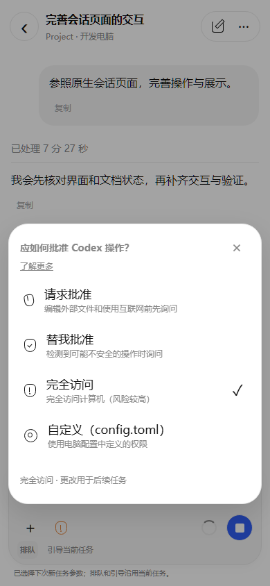
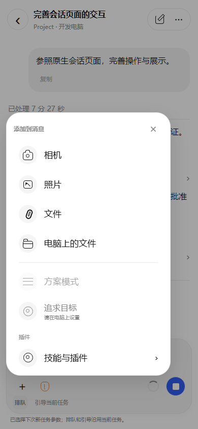
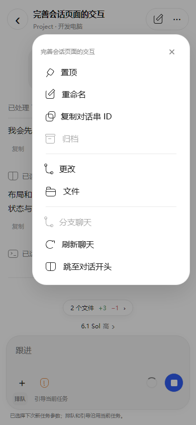
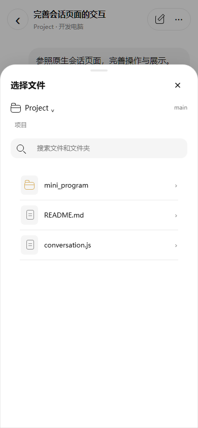

# 小程序 Codex 会话页面 3.3.0

版本：小程序 **3.3.0**；Windows / Cloud / Web **1.22.0**。日期：2026-10-05。

本轮根据提供的 ChatGPT iOS Codex Remote 七张参考图，优化 Codex 二级会话页。首页使用既有的最近/项目列表，会话接口继续来自目标电脑的原 Codex 窗口。

## 操作与展示

| 入口 | 行为 |
| --- | --- |
| 聊天顶部 | 返回、会话标题、项目与电脑副标题、新建、更多；连接异常时提供重连 |
| 工作过程 | 运行计时位于本轮过程开头；完成后整轮过程自动折叠，最终回复保留；展开状态在刷新中保留 |
| 命令与活动 | 连续活动显示数量摘要，展开后可逐条查看；读取、目录、搜索使用原生活动标记；单条命令仍默认折叠，展开显示命令、输出和退出码，全文可分段阅读与复制 |
| 思考与状态 | 公开思考摘要单独折叠；不读取私有推理。末尾工作状态可展开查看任务计划；精简上下文用分隔行显示 |
| 图片 | 查看/生成记录、用户附件与回复内图片默认折叠；展开才按会话授权读取。140px 等比例缩略图点击进入微信原生预览，支持缩放及同一条消息内多图切换 |
| 输入栏 | 未输入时使用紧凑胶囊，键盘或附件打开后展开；保留队列/引导、停止、回执和内存草稿；附件与更改摘要不挤占历史正文 |
| 模型与智能 | 点击输入栏上方模型进入“高级”；模型列表与离散强度轨道读取电脑实际支持值，不硬编码模型或未支持的 Max 等强度。切换模型时修正不兼容强度，刷新保留未发送的选择 |
| 批准状态 | 请求批准、替我批准、完全访问、自定义；显示原窗口实际权限，三个预设沿用网页权限接口。确认期间冻结发送，收到电脑确认后更新；切换聊天/电脑或断线后的旧确认不能进入新会话 |
| 附件菜单 | 相机、照片、微信文件选择、电脑上的文件、支持时的方案模式、技能与插件。相机和相册分别调用原生入口，普通文件选择切后台后等待同一会话恢复再上传，避免重复添加 |
| 聊天菜单 | 置顶、重命名、复制对话串 ID、归档/恢复、更改、文件；继续保留分支、刷新、开头读取和旧模式交还桌面 |
| 更改摘要 | 输入栏上方展示最近一轮有更改的文件数量和新增/删除行数；点击浏览文件、完整 Diff 和分页。不把原生 turn diff 与文件事件重复累计 |
| 电脑文件对话框 | 授权项目选择、路径导航、搜索、目录分页、文本预览及添加引用；选择后返回原会话，完整文件正文可分段阅读 |
| 工作状态菜单 | 连接、同步、耗时、原生上下文及额度；缺失数据说明实际原因，不计算虚假的剩余百分比 |

批准权限更改用于后续任务，正在运行的任务和已有审批保留原设置。完全访问需在小程序中确认；自定义权限在电脑配置，旧电脑未提供权限切换能力时显示更新提示。短期网络变化不会自动发送新的任务。

速度展示沿用网页现有的“标准”，当前没有额外的快速档位接口。追求目标需要在电脑上设置，语音输入使用系统键盘；小程序未接入独立目标或语音服务。插件列表来自电脑的实际目录，未安装的插件不会因为参考图出现而默认启用。

## 编译后的实现预览

以下为微信 WCC/WCSC 编译产物与浏览器 DOM 适配器使用虚构会话数据的渲染，包含全局样式与微信 style v2 按钮规则。它们不包含微信系统导航栏或真实输入法，不是 iOS 或微信真机截图，也未使用用户参考图中的账号、机器名称、路径或会话内容。

| 会话 | 高级设置 |
| --- | --- |
|  |  |

| 智能强度 | 批准状态 |
| --- | --- |
|  |  |

| 附件 | 聊天操作 |
| --- | --- |
|  |  |



## 验证与人工验收

新增 **14 项**行为验证覆盖权限确认/失败/缺失、已有审批和任务保留、重复切换、断线新旧请求、会话隔离、原生设置通知、模型草稿、命令与思考折叠、图片懒加载与多图预览、文件选择返回及 Diff 去重。原有连接、状态、环境隔离和多页面检查继续保留。

编译布局在 **320/390/430px** 检查会话、逐条命令、工作状态、模型、强度、批准、附件、聊天菜单、文件浏览/预览、Diff、键盘抬升和深色；检查面板边界、横向溢出、按钮尺寸和单次 setData 低于 1 MiB。

微信真机的中文输入法、原生键盘、相机/相册/文件返回、系统图片手势、基础库与 5G 仍需人工复核。没有因为自动检查通过而宣称这些设备行为已验收，也没有发送真实推理任务或电源动作。

```powershell
node --test tests/test_mini_program_codex_ios.js
node tests/test_mini_program_codex_ios_layout.cjs
node tests/test_mini_program_codex.js
node --test tests/test_mini_program_codex_state.js
node tests/test_mini_program_codex_layout.cjs
```

导入完整 `mini_program`，或使用 `windows/out/CodexDock-mini-program-3.3.0.zip`；在微信开发者工具配置自己的 AppID 后重新编译、预览。包内保留 `touristappid`，排除私有配置与授权。协议仍为 `2`，升级沿用既有配对、权限和配置。本机 Docker / Windows 更新记录见 [本机开发](local-development.md)；正式云端部署需另行要求。
