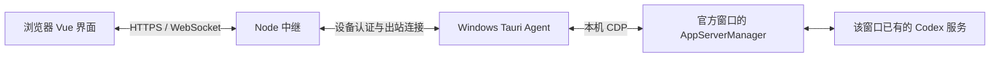

# Codex Remote Bridge 与 LanPower 实现对照

1.14.0 已复用参考项目的会话组件和原窗口接入机制，本机真实任务与审批已验证。使用与边界见 [原窗口整合说明](codex-original-window.md)。以下对比与测试记录保留为整合前 1.13.1 的分析快照。

日期：2026-10-03。文档修订：1.0。对照用户指定的本机 `codex-remote-bridge` 副本，版本 `0.1.101`、提交 `1bbcf5a`；LanPower 基线为 `1.13.1`、提交 `ffa715a`，小程序 `2.1.1`。本轮为源码分析与文档更新，不包含运行功能变更或新的部署验收。

## 结论

如果目标是在手机上继续控制平时使用的官方 Codex 桌面会话，并获得接近桌面的聊天与开发界面，参考项目的接入位置和界面基础更贴近这个目标。

LanPower 早期采用独立 app-server；1.13.1 已实现官方桌面与网页连接同一个共享服务，可以共同引导、暂停和操作原生队列。当前差距是：共享控制需要另开一个官方共享窗口，原有独立窗口的活动任务仍只能观察；网页和小程序也仅实现了部分 Codex 功能与有界历史。不能把这两种桌面入口都概括为已经可以控制。

参考项目的关键是接入官方窗口内部的本地 `AppServerManager`。其网页仍由自己的 Vue 组件渲染，共享的是任务与控制通道，界面完整度和视觉一致性需要分别验收。

## 它如何实现



1. Agent 从官方 WindowsApps 安装路径和进程命令行识别 Codex，只连接回环调试端口，校验页面地址为 `app://-/index.html`。
2. 通过 CDP 的 `Runtime.evaluate` 进入 renderer，遍历 `__codexRoot` 的 React Fiber/hook，按方法签名找到 `getHostId() === 'local'` 的管理器。
3. 网页请求经 Agent 调用 `manager.sendRequest()`。发送前在同一管理器中恢复会话，随后调用真实 `turn/start`；停止使用同一通道的 `turn/interrupt`。
4. 管理器通知、完成回调、流状态和会话状态经 `Runtime.addBinding` 回到 Agent，再按设备转发给浏览器。运行过程采用事件推送。
5. 审批订阅原生 `addApprovalRequestListener`，恢复接入前已有的待审批项；网页决定通过 `electronBridge.sendMessageFromView` 回到官方审批通道。原生已解决通知清除对应请求，避免两端重复处理。
6. 中继根据设备 ID 路由请求与事件；Agent 使用独立配对令牌认证，并具有心跳、重连、请求幂等和大响应分片。令牌在 Windows Credential Manager 中保存。

关键代码位于参考副本：

| 文件与位置 | 作用 |
| --- | --- |
| `apps/desktop-agent/src-tauri/src/cdp.rs:142` | CDP 连接、绑定、握手与事件接收 |
| `apps/desktop-agent/src-tauri/src/cdp.rs:406` | 官方进程和 renderer 发现 |
| `apps/desktop-agent/src-tauri/src/cdp.rs:699` | 查找管理器、事件订阅、审批与 RPC 适配 |
| `apps/desktop-agent/src-tauri/src/agent.rs:363` | 中继请求分发到本机操作或桌面桥接 |
| `src/server/desktopAgentRelay.ts` | 设备认证、路由、响应重组与事件转发 |
| `src/server/codexAppServerBridge.ts:9008` | 按运行模式选择 RPC 执行路径 |

## 与现有实现的差距

| 使用效果 | 参考项目 | LanPower 1.13.1 | 影响 |
| --- | --- | --- | --- |
| 控制原来使用的官方窗口 | CDP 接入该 renderer 的管理器，要求窗口启用调试 | 独立共享服务加官方共享窗口；旧窗口保留只读观察 | 当前最主要的接入差距 |
| 两端运行状态同步 | 从原窗口管理器订阅事件与状态 | 共享窗口走同一服务事件；旧窗口读取本机保存记录和写锁，网页约每 2 秒刷新 | 旧窗口的观察无法提供相同的实时控制体验 |
| 聊天和开发界面 | Vue 会话、输入、命令、文件变更、计划、审批等独立组件 | 网页为精简原生脚本，小程序为原生页面与专门的 Markdown/状态映射 | 后续需要补齐展示和交互，接通服务本身不能补齐界面 |
| 发送上下文 | 组件具有图片、文件、技能与协作/推理选项；设备模式逐项核验 | 协议仅允许单项文本，部分模型选项；没有对应的完整上下文接口 | 现有协议限制也会限制前端能力 |
| 会话操作 | 通用 RPC 转发，界面具有更多操作 | 方法白名单；当前没有分叉、回滚、配置写入等通用接口 | 采用更多组件需要逐项增加可用能力和权限规则 |
| 历史完整度 | 桌面适配器也只回传最近 10 轮，网页有历史翻页入口 | 最近 8 轮，每轮最多 80 项，文本与总量受限，网页无完整历史翻页 | 两者都不能仅凭首页展示宣称完整镜像 |
| 排队 | 自有网页队列与服务器后台处理器 | 共享模式使用真实 `thread/queue/*`，桌面显示同一队列；小程序尚无队列界面 | LanPower 原生队列能力应保留 |
| 设备与手机授权 | 设备令牌与网页密码；文档说明多租户还需用户到设备的授权关系 | 已有账户归属、手机 Codex 权限、撤销、项目授权，每台电脑只允许一个远程控制连接 | 中继与授权规则需要明确适配 |
| 电源与离线恢复 | 主要提供 Codex 远程界面 | 已有电脑状态、Cloud、Wake Gateway 与唤醒入口 | 现有 LanPower 能力仍有价值 |

LanPower 的源码依据：

- [共享服务与官方窗口入口](../windows/LanPower.CodexHost/SharedCodexServer.cs)：`OpenDesktopAsync` 使用独立界面目录及 `CODEX_APP_SERVER_WS_URL`；`RunAsync` 启动回环 WebSocket app-server。
- [RemoteRuntime](../windows/LanPower.CodexHost/RemoteRuntime.cs)：共享连接与订阅、旧窗口观察、历史裁剪，以及远程即时任务的权限策略。
- [客户端协议](../windows/LanPower.Shared/CodexRemoteProtocol.cs)和 [Cloud 转发](../cloud_app/app/remote.py)：可调用方法、单项文本、设备所有权与控制连接限制。
- [网页](../cloud_app/static/remote.js)和 [小程序](../mini_program/pages/codex/codex.js)：实际渲染、发送、模型、审批与刷新行为。
- [共享控制记录](codex-remote-takeover.md)：现有真实验证和仍待验收的范围。

## 参考项目仍需核验的部分

### 启动与内部接口

普通 Codex 启动没有回环 CDP 时，Agent 返回需要重启的状态。托盘页面提供“重启并连接”并先提示确认；`cdp.rs:540` 的实现强制结束官方主进程树后，以调试参数重新启动。它不能给一个没有调试接口的正在运行窗口无损地补上接入能力。采用前应安排在活动任务完成后启用，后续重连应与重启明确区分。

React 根、管理器方法、页面地址和 Electron 审批消息均属于官方内部实现，升级可能失效。只支持 `local` 管理器的当前实现也不能直接推导为支持官方远程 host。多窗口时当前发现流程选择首个有效目标，仍需验收目标选择。

OpenAI 官方 [App Server 文档](https://learn.chatgpt.com/docs/app-server)说明了 thread/turn RPC、通知、恢复与读取的区别，并将 TCP WebSocket 传输标为实验性。CDP 管理器入口和 LanPower 桌面环境入口的兼容性应分别按实际官方版本验证。

### 不同模式没有完全统一

`CODEXUI_DESKTOP_DRIVER=agent` 将普通 App Server RPC 全部转发到设备；`cdp` 模式在普通 RPC 分发中只接管 `turn/start` 和 `turn/interrupt`，其他普通 RPC 继续走 Node 本地 app-server。审批另有桌面分发。未设置时为 `off`。部署必须核对实际模式。

源码还存在以下设备模式适配缺口，本轮未将其判定为真实端到端测试结果：

- **历史翻页**：`src/api/codexGateway.ts:794` 调用 `/codex-api/thread-turn-page`；`src/server/codexAppServerBridge.ts:9087` 仍调用 Node 本地 `appServer.readThreadForTurnPage()`，没有按所选设备转发。与桌面响应最近 10 轮的裁剪合在一起，不能假定手机能读到全部旧消息。
- **网页队列**：`/codex-api/thread-queue-state` 保存中继本地队列状态，`BackendQueueProcessor` 订阅本地 app-server，执行也调用该对象的 `thread/resume` 和 `turn/start`。这条路径不能视为与官方桌面的原生队列同步；在中继与受控电脑分离部署时需核验执行位置和设备归属。
- **文件与辅助操作**：Rust `local_ops.rs` 当前明确适配目录建议、Git 分支和图片读取；例如项目 ZIP 路由仍操作 Node 本地文件系统。README 中保留的本地功能需要逐项确认是否已经转发到受控电脑。
- **部署规则**：参考项目文档明确指出多租户还需用户与设备授权。它还有中继本地网页队列持久化，采用时需要核对任务内容保存位置，不能直接沿用 LanPower“Cloud 不保存任务正文”的说明。

## 建议的后续方向

优先复用成熟 Vue 界面与接入原窗口的 CDP 适配思路，保留 LanPower 的设备身份、账户/手机授权、项目范围、撤销和唤醒能力。应先在单台电脑验证接入位置，再决定界面与协议的整合范围。

最小真实验收应使用独立测试项目，确保从原窗口创建的同一条会话能在网页继续，网页消息在该窗口出现，两端能引导、暂停和处理同一个审批，断线重连不会重发任务；随后核对原生队列、超过 10 轮的历史、图片/文件，以及手机网络切换。还需验证撤销、错误设备、官方升级和窗口选择。网页组件不直接运行在微信原生页面中，小程序需单独适配；浏览器可以直接采用这套界面。

## 本轮最小验证

参考项目运行以下现有定向测试，9 个文件、67 项通过：

```powershell
node node_modules/vitest/vitest.mjs run src/server/codexDesktopCdp src/server/desktopAgentRelay.test.ts src/desktop-agent/protocol.test.ts src/desktop-agent/agentConnection.test.ts src/server/codexAppServerBridge.realtimeBridge.test.ts
```

LanPower 使用本机已有 .NET SDK `10.0.401` 运行共享控制测试，5 项通过：

```powershell
dotnet test windows/LanPower.UnitTests -c Release --no-restore --filter "FullyQualifiedName~SharedCodexTests" --nologo
```

这些是已有模拟管理器、传输和共享服务的定向自动测试；Rust Agent 生产程序、本轮真实桌面任务与手机操作未作新的端到端验收。对实现机制的结论来自当前源码，不以自动测试替代真实使用效果。
