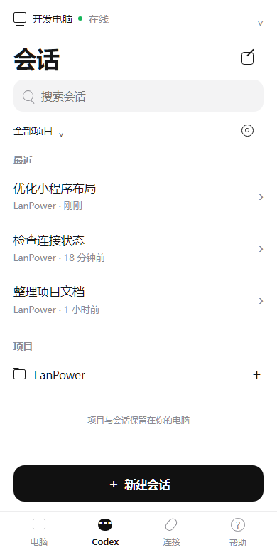
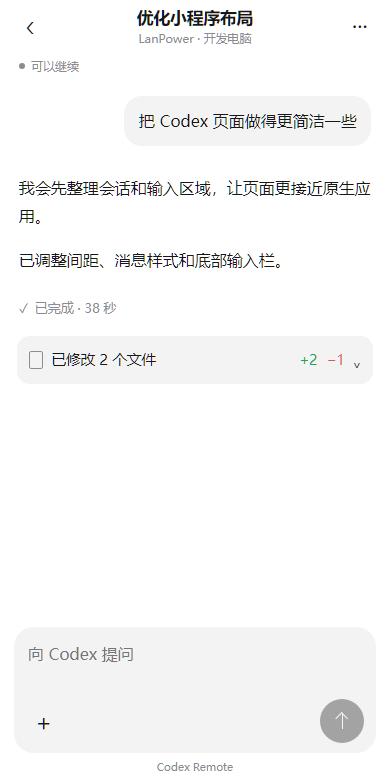
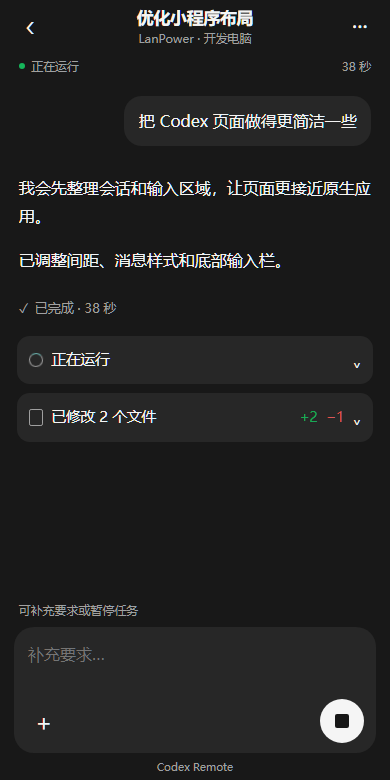
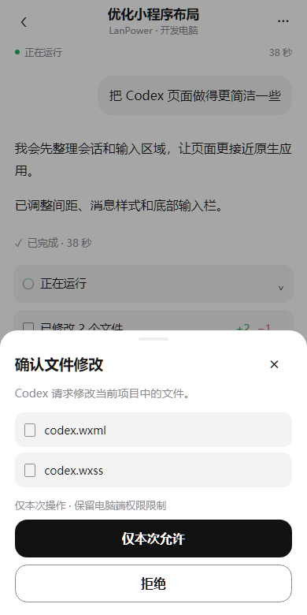

# Codex Remote 微信小程序第一版

版本：小程序 **2.1.0**，Cloud / Windows **1.12.0**，2026-10-03。采用设计稿 A 的白色极简主界面，加入 B 的深色模式和 C 的单次审批弹层，使用原生 WXML、rich-text、scroll-view、textarea、picker 与 SocketTask。

## 进入第一版

1. 在微信开发者工具完整导入仓库 `mini_program` 目录，配置自己的 AppID，重新编译或预览。公开项目继续使用 `touristappid`，私有身份不提交。
2. 自己的 Cloud 更新至 1.12.0，在微信公众平台配置该 Cloud 的 HTTPS request 和 WSS socket 合法域名。当前本机 localhost 开发入口只能由本电脑访问；远程服务器本轮没有部署。
3. Windows 端保持 Codex 已登录，在 LanPower「远程连接」启用 Codex Remote 并保存项目授权。建议安装同版本 Windows 1.12.0。
4. 在 Cloud「手机授权 → 修改手机权限」为已有手机勾选 **Codex Remote 远程开发** 并保存，无需重新扫码。新手机在生成二维码前勾选该权限，随后使用小程序连接页扫码。
5. 点击底部 **Codex**，选择开发电脑。若网页仍连接同一台电脑，关闭该控制页面后重新连接。

手机开发权限与电脑项目授权都需有效。原有电源授权不会在升级时自动得到开发权限；关闭手机开发权限不会重置长期授权或局域网配对。

## 已实现的页面与操作

- 会话首页：电脑切换、最近会话、名称搜索、项目筛选、加载更早会话，以及项目中新建会话。
- 消息详情：用户气泡、AI 富文本、实时输出、任务耗时、可展开执行过程和文件 Diff、返回列表和查看最新消息。
- 输入栏：空闲时发送任务；运行中输入补充要求；空输入时暂停。收到电脑确认后更新任务状态，不用超时推断任务已结束。
- 底部弹层：选择项目或模型，切换系统/浅色/深色；命令和文件仅批准这一次或拒绝，网络权限仅当前任务，工具问题可填写答案。
- 会话交还：闲置远程会话可交还桌面；桌面占用中的会话每两秒同步查看，发送与暂停禁用。

连接恢复后查询实际活动任务、近期消息和待审批，任务与审批决定均不自动重发。切到后台关闭手机长连接，已有任务继续在电脑运行；返回前台恢复查询。消息、代码、Diff 和审批内容不写手机本地存储，仅记住外观偏好。Cloud 使用既有内存 Relay，不保存任务正文。

## 实现界面截图

以下使用编译后的实际页面与虚构示例数据，在 390px 宽浏览器 DOM 适配器中渲染；不包含微信系统导航栏。它们是实现预览，不是微信真机截图。

| 白色会话列表 | 白色消息详情 |
|---|---|
|  |  |

| 深色任务详情 | 单次审批弹层 |
|---|---|
|  |  |

原始方向见 [三组设计效果图](design/codex-remote-mini-program-v0.1/README.md)。

## 验证与验收边界

已通过小程序旧版及 v2 回归、Codex 原生连接与页面交互检查，Cloud **193 项**及 Windows **71 项**测试。新增检查覆盖独立手机鉴权、Cookie/设备/跨账户拒绝、权限撤销、单控制连接、RPC 与文件审批、断线不重发、旧连接隔离、安全富文本、桌面只读、发送/引导/暂停及审批防重复提交。

微信 WCC/WCSC 已编译三个注册页面。320/390/430px 的白色、深色、审批与键盘布局通过，包含微信 style v2 的 184px 默认按钮规则及实际按钮宽度检查。渲染使用浏览器 DOM 适配器，尚需用户在微信开发者工具与真机复核基础库行为、长连接 Header、系统深色切换、中文输入法及后台恢复。

本机更新与实际链路结果见 [本机开发指南](local-development.md)。真实微信与公网 5G 尚未验收；正式 Cloud 仍需用户另行要求部署后才能试用新入口。本轮未执行电源动作或发送微信通知。

## 开发检查

```powershell
node tests/test_mini_program.js
node tests/test_mini_program_v2.js
node tests/test_mini_program_codex.js
# 使用本机微信编译器及 Playwright 的实际页面布局检查
node tests/test_mini_program_codex_layout.cjs
```

布局脚本支持 `WECHAT_COMPILER_DIR` 和 `PLAYWRIGHT_MODULE_PATH` 环境变量，检查产物写入被忽略的 `private/mini-codex-1.12`。协议与限额见 [Relay v1](codex-remote-protocol.md)。
