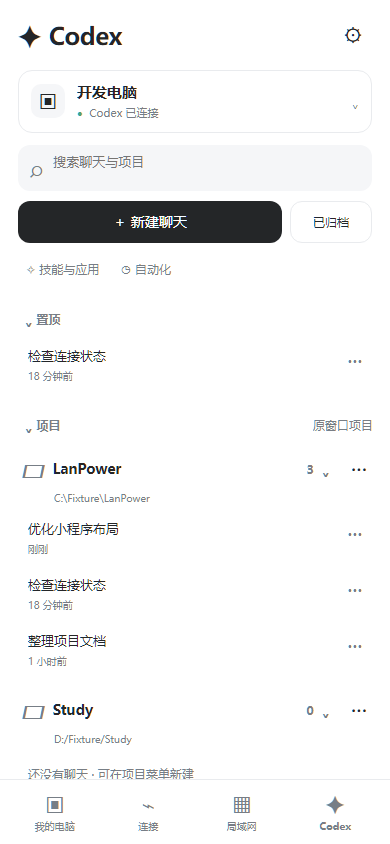
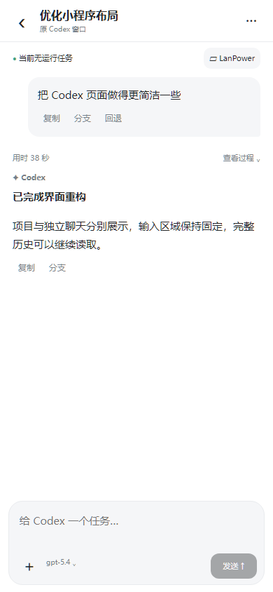
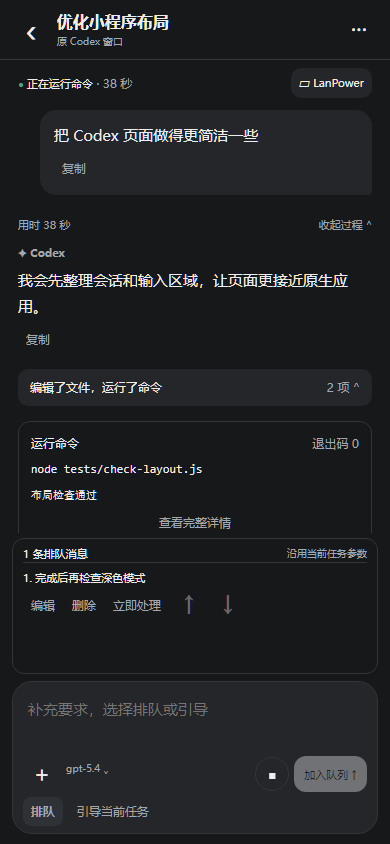
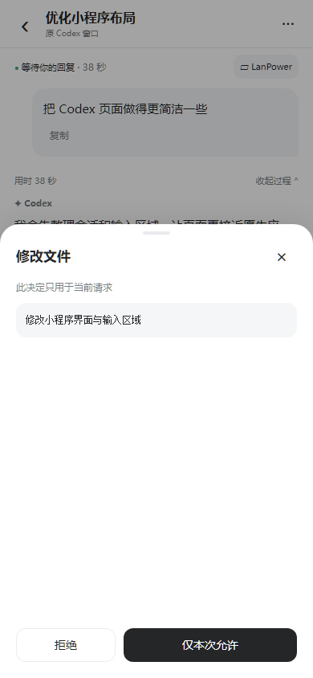
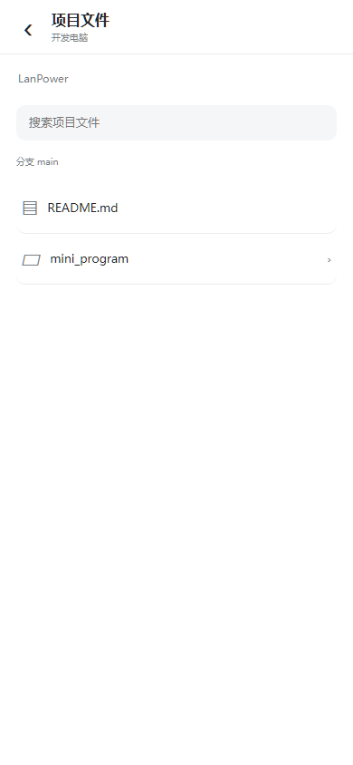

# CodexDock 微信小程序

当前产品名称为 **CodexDock**；小程序源码为 `3.3.0`，配套 Windows / Cloud / Web 为 `1.22.0`。主功能是 Codex Remote 远程开发与会话控制，电源管理为配套功能。当前入口和新版首页见 [使用指南](codex-remote.md) 与 [首页说明](codex-mini-home.md)。以下保留 3.0 工作台的实现范围与验收记录。

`3.3.0` 会话内容页按 iOS 参考改为轻量活动行和独立折叠；模型、智能强度、批准、附件、聊天管理、文件选择与更改使用原生弹窗。实际权限确认与未接入能力、编译预览和验收范围见 [会话页面说明](codex-mini-conversation.md)。

小程序 `3.2.2` 按 ChatGPT iOS Codex 页面重做首页：最近与项目列表、电脑选择、搜索、弹出排序/管理菜单及原生剩余用量均接入已有功能，支持浅色与深色。入口和验证见 [首页说明](codex-mini-home.md)。

版本：小程序 **3.0.1**，Windows / Cloud / Web **1.18.0**，2026-10-04。

小程序的 Codex 控制已从原来的简化页面重构为原生工作台。页面使用 WXML、WXSS、rich-text、scroll-view、textarea、picker 与 SocketTask；项目、聊天、文件、能力目录和设置按手机操作重新组织。所有控制沿用网页端的目标电脑接口，历史、队列与审批来自同一个原 Codex 窗口。

当前小程序 `3.4.0` 默认进入 Codex 工作台；连接授权、电脑电源与帮助已拆为独立页面，入口和电脑选择规则见 [页面结构](mini-program-navigation.md)。

## 导入与连接

1. 在微信开发者工具导入仓库的完整 mini_program 目录，或解压本机 windows/out/LanPower-mini-program-3.0.1.zip 后导入其中的 mini_program。配置自己的 AppID，重新编译或预览；公开源码与包内保留 touristappid。
2. Windows、Cloud 建议使用本轮 **1.18.0**。本机网站已更新，正式云服务器需另行部署后才能使用本轮配套版本。微信公众平台需配置实际 Cloud 的 HTTPS request 与 WSS socket 合法域名。
3. 在 Windows CodexDock「远程连接」启用 Codex Remote 并保存项目授权；原 Codex 窗口保持登录。Service 负责中继，交互用户的 Codex Host 负责连接原窗口。
4. 在 Cloud「手机授权 → 修改手机权限」为手机勾选 **Codex Remote 远程开发**。已有手机无需重新扫码；新手机在生成授权二维码前勾选此权限。原电源授权不会自动获得开发权限。
5. 点击小程序**Codex** 首页，选择开发电脑。新版支持多个网页、小程序同时连接；关闭一个控制页不会中断其他页面或电脑上的任务。旧运行模式按实际能力显示只读或交还桌面。

开发版可在「连接 → 开发版 Cloud 地址」修改测试地址，开发、体验与正式版分别保存授权、配对和连接状态，详见 [环境隔离](mini-program-environments.md)。手机访问本机时使用局域网 HTTPS 入口，不能使用手机自身的 localhost；需信任开发 CA，并按微信开发工具的实际域名校验要求调试。

## 与网页端的功能对照

此表以当前 CodexDock 网页已经接入的功能为准。

| 网页能力 | 小程序原生操作 |
| --- | --- |
| 电脑与连接 | 原生电脑选择器、状态提示、重连、可用时唤醒；断线显示缓存并暂停控制 |
| 项目与独立聊天 | 完整目录区分同名项目，保留空项目；独立聊天与项目聊天分别展示，搜索、分组分页、归档列表和服务器游标读取 |
| 项目整理 | 展开/收起、上移/下移、显示名、收纳/恢复、置顶、创建/更新时间排序、独立聊天优先；在目标电脑保存并与网页同步 |
| 聊天管理 | 项目内新建、独立聊天、重命名、分支、从指定轮分支/回退、归档/恢复、刷新；旧模式按条件提供交还桌面 |
| 完整会话 | 流式回复、安全富文本、公开思考摘要、计划、耗时、过程折叠、命令分组、退出码、文件 Diff、错误和图片 |
| 长历史与超大条目 | 更早内容、跳至开头、取消/续读、后续分页、回到最新；自动缩页与分段补齐，完整正文在页面分段阅读及复制 |
| 下一次任务参数 | 原会话模型、思考强度、默认/计划模式；未发送的选择与原窗口状态分开，刷新保留用户选择，按模型能力限制选项 |
| 输入与草稿 | 每台电脑、每段聊天分别保留内存草稿、图片、技能、文件引用和队列编辑；键盘完成键行为可设置 |
| 发送与回执 | 等待电脑确认、明确失败恢复输入、结果不确定时冻结提交并查询回执；重连恢复状态，不自动重发任务 |
| 运行中控制 | 加入原生队列、引导当前任务、停止；队列编辑、删除、排序与立即开始，保留图片及技能输入 |
| 审批与问题 | 命令/文件单次批准或拒绝、涉及文件路径、仅当前任务的网络权限、单选/多选/自由回答/秘密回答；等待确认并防重复提交 |
| 目标电脑文件 | 已授权项目目录、路径导航、上一级、搜索、分页、文本预览、完整预览分段阅读与加入消息 |
| 原会话图片 | 通过带会话授权的图片 RPC 读取目标电脑，使用原生图片预览；相册图片以原生 image 输入发送 |
| 技能、插件、应用、MCP | 项目选择、搜索、目录分页、详情、技能加入消息、MCP 重新加载 |
| 自动化与偏好 | 查看该电脑的已授权项目自动化配置；跟随系统/浅色/深色、输入行为和整理偏好 |

与网页相同，工具安装、OAuth 与 MCP 授权在电脑处理；小程序可拒绝或取消 MCP 请求。自动化创建/编辑/调度、提供商账号、Git 工作树、完整终端、补丁撤销/重做与语音服务尚未由 CodexDock 网页接入，继续在原桌面管理。项目整理属于 CodexDock 电脑端组织状态，不直接改写官方桌面的全局状态文件。

聊天正文、命令输出和 Diff 自动补齐后直接阅读；沿用网页当前的阅读方式，没有会话下载或 JSON 导出菜单。文件读取仍遵守 Host 的目录授权、二进制和文件大小边界，超限会明确说明。

## 重构后的代码职责

| 文件 | 职责 |
| --- | --- |
| utils/codex-remote.js | 微信 WSS、独立手机鉴权、请求生命周期、取消、分段响应、审批确认和断线处理 |
| utils/codex/controller.js | 目标电脑/聊天状态、事件与快照顺序、恢复、发送回执、队列、会话管理和审批 |
| utils/codex/model.js | 项目完整路径归属、电脑端整理偏好、内存草稿、原生参数与下一次参数、状态版本 |
| utils/codex/history.js | 游标分页、自动缩页、可取消/继续的开头读取、大条目重组和过期引用恢复 |
| utils/codex/conversation.js | 原始条目转为原生消息、过程折叠、命令/文件分组和有限可视窗口 |
| utils/codex/approvals.js | 审批投影、问题选项与答案、单次授权和当前任务网络范围 |
| utils/codex/resources.js | 目标电脑目录/文件、能力目录与认证图片缓存 |
| pages/codex/codex.* | 原生页面、输入/键盘/相册适配、布局、主题和用户操作 |

原始历史保留在控制器内存中，页面只投影当前可视窗口，单次 setData 保持低于 1 MiB。完整文本不因预览、分页或折叠被裁剪。设备、聊天和连接代次共同约束异步结果，切换电脑、切后台、断线后的旧回执不能进入新会话。

正文、代码、Diff、问题答案、草稿与发送回执不写微信键值存储或 Cloud 数据库。图片预览会写入专用临时文件缓存，切后台、换电脑、断线及卸载页面时清理；外观与输入偏好按环境保存。相册临时返回不会丢弃当前聊天的图片草稿。电脑端整理文件只保存目录、名称、标识和偏好，不保存聊天正文。

## 实现界面预览

以下图片使用编译后的 WXML/WXSS、全局样式和虚构接口数据渲染，未包含微信系统导航栏，属于自动化实现预览。

| 项目与聊天 | 原生会话 |
| --- | --- |
|  |  |

| 深色队列与输入 | 单次审批 |
| --- | --- |
|  |  |

| 技能目录 | 项目文件 |
| --- | --- |
|  |  |

## 验证与验收边界

本轮自动检查：

- 原生连接与页面集成：鉴权、分段 Unicode、断线不重发、草稿/电脑隔离、发送/排队/引导/停止、单次审批、长正文、安全富文本和后台恢复。
- **27 项**控制器与功能场景：参数覆盖隔离、发送确定性、原生队列完整输入、晚到事件/快照、大量聊天、完整项目路径、整理冲突、会话管理、审批范围、历史缩页/取消/续读/游标循环、大内容重组、可视窗口、文件目录与图片清理。
- 微信 WCC/WCSC 编译后的 **320/390/430px** 页面：项目列表、聊天、过程/命令折叠、队列、浅色/深色、审批、键盘抬升、技能、文件和设置；检查微信 style v2 默认按钮规则、全局字体继承、横向溢出和单次原生数据更新大小。
- 既有 LAN、Cloud v2、环境隔离与多页面回归通过；网页 **47 项**测试和正式构建通过；Cloud **47 项** Codex 权限、可靠性、队列与多页面测试通过。
- 本机 Docker/Windows 配套升级及保留检查见 [本机开发记录](local-development.md)。

上述原生接口替身与 DOM 适配器检查不等于微信真机验收。微信基础库、实际中文输入法、系统键盘、相册返回、系统主题切换、后台恢复和公网 5G 仍需人工复核。本轮没有发送真实推理任务、执行电源操作或部署正式 Cloud。

## 开发检查

    node tests/test_mini_program.js
    node tests/test_mini_program_v2.js
    node tests/test_mini_program_environments.js
    node tests/test_mini_program_codex.js
    node --test tests/test_mini_program_codex_state.js
    node tests/test_mini_program_codex_multi_page.js
    node tests/test_mini_program_codex_layout.cjs

布局脚本支持 WECHAT_COMPILER_DIR、PLAYWRIGHT_MODULE_PATH 和 MINI_PROGRAM_SOURCE_DIR，产物写入被忽略的 private/mini-codex-3.0。协议与限额见 [Relay 协议](codex-remote-protocol.md)，共享控制行为见 [多页面控制](codex-multiple-pages.md)。
