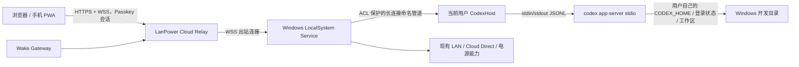

# Codex Remote MVP 可行性结论与执行计划

**日期：** 2026-10-02
**当前状态：** 可行性已验证，尚未开始实现
**目标版本：** LanPower `1.8.0`（Windows / Cloud / 安装器），微信小程序协议保持兼容并在实现完成后更新显示版本
**执行方式：** 后续 Codex 应按本文顺序执行，完成一个阶段的验证后再进入下一阶段；本文件不是生产部署授权。

## 给 Codex 的直接执行指令

阅读本文后，在 `D:\GitHub\LanPower` 继续实现 Codex Remote MVP。保留现有 LAN Direct、Cloud Direct、Wake Gateway、电源管理、微信小程序和现有数据格式；不重写现有电源命令链路，不开放 Windows `48211`、路由器 SSH、UDP 9 或任何新的公网入站端口。所有实现、测试、版本更新和文档更新完成后，先在本机 Docker 和本机 Windows 做最小验证，再提交本次改动；除非用户另行要求，不同步远程仓库、不部署云服务器、不创建 Release。

实现过程中应优先使用官方 `codex app-server` 的协议 Schema 生成器确认字段，不凭记忆复制协议结构。Runtime 的代码、ChatGPT/Codex 登录状态和配置必须只留在用户 Windows 会话；Cloud 只能短暂转发消息、保存设备/会话连接状态和不含正文的审计事件。任何日志、异常、数据库记录和测试输出都不得写入 API Key、登录凭据、完整代码、Diff 正文或审批正文。

## 1. 可行性结论

### 1.1 已验证并通过

1. 本仓库当前源码为 `1.7.2`。Windows 服务已经使用 .NET 10、Cloud 设备凭据和出站 HTTPS；Cloud 已有设备所有权校验、Bearer Token、设备心跳、命令排队、SSE 状态流和审计表，适合增加一条独立的远程 Runtime Relay。
2. 本机安装的 Codex CLI 支持 `codex app-server --listen stdio://`。使用临时 `CODEX_HOME` 做了真实进程验证：
   - `initialize` 返回成功；
   - `thread/list` 返回空列表和游标；
   - `thread/start` 返回真实 Thread、工作目录、模型和沙箱信息；
   - `generate-json-schema` 成功生成 `ClientRequest`、`ServerRequest`、`ServerNotification` 及审批、Diff、用户输入等 Schema。
3. app-server 的 stdio 协议是换行分隔 JSON；因此可由 Windows 用户会话中的 Host 进程用标准输入/输出桥接，不需要模拟鼠标键盘，也不需要远程桌面。
4. FastAPI/Starlette 当前应用可以增加 WebSocket 路由，现有 Caddy 反向代理可承载 WSS；Windows 端可以使用 .NET `ClientWebSocket` 主动出站。故公网链路在网络层可行。
5. 当前 Cloud 测试基线通过：`cloud_app/.venv/Scripts/python.exe -m pytest cloud_app/tests -q`，共 `164 passed`。这证明本次设计可以作为增量能力加入现有平台。

### 1.2 必须遵守的约束

1. 当前 Codex CLI 已能解析 `--listen ws://...` 并提供 WebSocket 认证参数，但直接暴露 app-server 网络监听会引入另一套端口、认证和用户会话边界。MVP 不直接启动 app-server 网络监听；只启动本机 `stdio://`，公网使用 LanPower 自己的 WSS Relay。这样可以继续保持“Windows 主动出站、Cloud 转发、无新增公网入站端口”的安全边界。
2. 现有 `LanPower.Service` 以 LocalSystem 运行，Cloud 凭据保存在机器级 DPAPI 文件；LocalSystem 子进程不能假设拥有当前交互用户的 `CODEX_HOME`、ChatGPT 登录状态或桌面权限。MVP 必须拆成：
   - LocalSystem 服务：维持 Cloud WSS、权限校验、电源能力和消息转发；
   - 当前登录用户的 `LanPower.CodexHost.exe`：启动本机 `codex app-server --listen stdio://`，读写用户自己的 Codex Home；
   - 两者之间使用只允许 Interactive 用户、LocalSystem 和管理员访问的长连接命名管道。
3. Cloud 可以在内存中转发代码、模型输出和 Diff，但不得把正文写入 SQLite、活动页、普通应用日志、反向代理访问日志或错误追踪。Cloud 只记录连接、开始任务、审批决定、打断和断开等事件的类型、设备编号和时间。
4. 本机当前没有 .NET SDK，只有 .NET 运行时；因此本轮不能宣称 Windows 编译通过。未来实现必须在匹配的 .NET 10 SDK 或 CI 中构建和测试，不能把这个环境限制误判为产品不可行。

### 1.3 当前未验证的事项

- 真实公网域名、Caddy/Cloudflare 入口的 WSS 转发；
- 已登录用户的真实 Codex 任务、模型输出、审批和修改 Diff；
- Windows 锁屏、注销、重启后的用户 Host 自动启动；
- 手机浏览器在 5G 下的 Passkey、WebSocket 重连和长任务体验；
- 生产 Cloud、远程路由器和物理电源动作。

这些项目必须在实现后由本机验收和用户手动验收分别确认，不能从本次协议验证推断成功。

## 2. MVP 范围

### 2.1 必须交付

- 浏览器/PWA 登录现有 LanPower Cloud 后选择一台 Windows 电脑；
- 显示 Windows Cloud 在线状态和 Codex Runtime Host 是否可用；
- 通过同一条 WSS 连接创建、列出、恢复本机 Codex Thread；
- 发送一次或连续的开发任务，实时显示 Agent 文本、进度、工具输出摘要和错误；
- 接收并显示命令执行、文件变更、权限和用户输入审批请求，允许明确批准或拒绝；
- 显示 `turn/diff/updated` 的最新 Diff；
- 支持 `turn/interrupt` 中断当前任务，支持断线后重新连接并继续读取本地 Thread；
- 记录不含正文的审计事件，设备移除/撤销后立即断开并拒绝新的连接；
- Cloud 不保存 OpenAI API Key、ChatGPT 登录凭据、Codex Token、代码正文或 Diff 正文；
- 现有 LAN、电源、Gateway、Cloud Direct 和小程序路径保持原行为。

### 2.2 明确不做

- 不做远程桌面、屏幕流、鼠标键盘模拟或浏览器自动化；
- 不做公网 Shell、反向 Shell、任意文件上传下载、端口转发或代理；
- 不把 app-server 的 WS 监听地址、Windows `48211` 或本机命名管道暴露给公网；
- 不在 Cloud 代存或代用用户的 OpenAI API Key、ChatGPT Cookie、Codex 登录文件；
- 不从远端自动发起 Codex 登录、账号切换、插件安装、配置写入或任意文件系统 RPC；
- 不把微信小程序改造成 Codex 控制端。第一阶段手机入口是 Cloud PWA；小程序后续可复用 scoped client token，但不阻塞 MVP。

## 3. 目标架构



### 3.1 三层责任

**Cloud Relay** 负责浏览器身份验证、设备所有权、连接登记、内存转发、速率限制、断线通知和无正文审计。Relay 进程重启后不恢复消息正文；Thread 和 Codex 历史由本机 Runtime 管理。

**Windows Service Agent** 负责用现有设备 Access Token 主动连接 Cloud、检查设备是否仍有效、把消息转发给用户 Host、汇报 Runtime 可用性，并继续运行原电源和心跳逻辑。Cloud Token 刷新必须与现有 `CloudAgent` 共用一个 `CloudTokenSession`，防止两个后台线程同时消费单次 Refresh Token。

**CodexHost** 负责用户会话和 Runtime 进程生命周期。它不能读取或保存 Cloud Refresh Token，不能监听 TCP，不能执行 Relay 自定义的 Shell 命令；它只接受经过 Service 转发的、受方法白名单限制的 app-server JSON-RPC，并把 Runtime 的 JSONL 原样返回给 Service。

## 4. Relay 与 Runtime 消息契约

### 4.1 LanPower 外层 Envelope

Cloud 不修改内部 JSON-RPC 的 `id`、`method`、`params`、`result`、`error`，只包一层明确的类型。建议使用以下结构：

```json
{"type":"runtime_request","request_id":"client-uuid","payload":{"id":1,"method":"thread/list","params":{"limit":20}}}
{"type":"runtime_message","payload":{"id":1,"result":{"data":[]}}}
{"type":"runtime_status","state":"ready","runtime_version":"0.159.0"}
{"type":"runtime_error","code":"host_unavailable","message":"Codex Runtime Host 未运行"}
```

`request_id` 仅用于 Relay 路由和幂等检查；不能替换 app-server 内部 `id`。没有 `id` 的 Runtime 通知广播给同一设备的已授权浏览器连接；有 `id` 的响应优先回到发起该请求的浏览器。审批响应必须沿用原始 Server Request 的 `id`。

### 4.2 连接与限制

- Agent 连接：`GET /api/v2/remote/agent`，只接受 Windows Device Access Token 的 `Authorization: Bearer ...`；拒绝 query string Token。
- 浏览器连接：`GET /api/v2/remote/client/{device_id}`，只接受当前 Cloud Web Session；校验 `Origin` 与 `LANPOWER_PUBLIC_URL`，拒绝跨站 WebSocket。
- 同一设备最多一个 Agent、最多四个浏览器连接；新 Agent 替换旧连接前发送 `agent_replaced`，旧连接立即关闭。
- 单帧上限 1 MiB，单连接待发送队列最多 256 帧；超限关闭连接并写入 `remote_backpressure`，不落正文。
- 连接空闲 60 秒发送 Ping；Agent 或浏览器 90 秒无响应后断开。Runtime 长任务不以空闲时间判断，收到有效通知即可续期。
- Relay 只在内存保留路由表和待发送帧；禁止把 Envelope 或 `payload` 传给 `platform.record`、`ServiceLog`、SQLAlchemy、模板上下文或反向代理日志。
- 所有 RPC 方法在 Service 和 Cloud 各做一次白名单校验；未知方法返回 JSON-RPC `-32601` 或 LanPower `method_not_allowed`，不能退化为任意转发。

### 4.3 MVP 方法白名单

浏览器可以发往 Runtime 的方法：

`initialize`、`initialized`、`thread/list`、`thread/start`、`thread/resume`、`thread/read`、`thread/turns/list`、`thread/items/list`、`thread/name/set`、`thread/archive`、`thread/unarchive`、`model/list`、`account/read`、`account/rateLimits/read`、`turn/start`、`turn/steer`、`turn/interrupt`。

Runtime 发往浏览器的 Server Request 至少支持：

`item/commandExecution/requestApproval`、`item/fileChange/requestApproval`、`item/permissions/requestApproval`、`item/tool/requestUserInput`、`mcpServer/elicitation/request`。UI 必须显示操作摘要、工作目录、命令/文件变更的必要上下文和明确的批准/拒绝按钮；不能默认批准。

禁止从浏览器远程调用 `account/login/*`、`account/logout`、`config/*`、`fs/writeFile`、`plugin/install`、`plugin/uninstall`、`command/exec`、任意 Gateway OAuth 或本地凭据写入方法。后续若要开放这些方法，必须单独设计权限、审计和人工验收。

## 5. 分阶段执行清单

### 阶段 A：协议和安全基线

- [ ] 新增 `docs/codex-remote-protocol.md`，写明 Envelope、错误码、超时、大小、方法白名单和不记录正文的规则。
- [ ] 在实现脚本中调用 `codex app-server generate-json-schema --out <临时目录>`，从当前 Runtime 生成稳定 Schema；把必要方法的字段校验固化为测试夹具，不把完整 Schema 或本机 Runtime 数据提交到仓库。
- [ ] 增加 Python 的 Envelope 校验函数：对象类型、必填字段、设备/连接绑定、帧大小和 JSON 深度限制。
- [ ] 增加 C# 的 Envelope/RPC 校验函数：方法白名单、`id` 类型、单行长度、禁止未知外层字段；测试中确保 Token、Cookie、完整代码和 Diff 不进入异常文本。
- [ ] 明确审计事件：`remote_connected`、`remote_disconnected`、`remote_task_started`、`remote_approval_decided`、`remote_interrupted`、`remote_error`、`remote_revoked`。事件只带 owner、device、method 类别、结果和时间。

**阶段验收：** 恶意 JSON、过大帧、跨设备请求、跨站 Origin、未知 RPC 和已撤销设备均在 Cloud 与 Agent 两端被拒绝；现有 164 项 Cloud 测试不回归。

### 阶段 B：Cloud WSS Relay

- [ ] 新增 `cloud_app/app/remote.py`，实现内存 `CodexRelay`：Agent 注册/替换、浏览器连接、连接状态、路由表、背压和关闭清理。
- [ ] 在 `cloud_app/app/main.py` 注册 `/api/v2/remote/agent` 与 `/api/v2/remote/client/{device_id}` WebSocket 路由；复用 `platform.tokens.authorize(..., expected_type="windows")` 和 Web Session，确认 owner、device_type、revoked_at 和设备存在性。
- [ ] 在连接前后校验 `Origin`、Authorization、设备所有权和协议版本；不能把设备 Token 放到页面、模板、URL、二维码或浏览器 localStorage。
- [ ] WebSocket 只发送 `no-store` 语义的状态，断开时通知页面；服务重启后所有连接都必须重新鉴权，不恢复内存正文。
- [ ] 增加 `remote` 页面路由和设备状态数据，但不把 Runtime 消息写入 Jinja 或数据库。
- [ ] 在 `EVENT_LABELS` 和活动页面增加审计事件中文名称；活动页不显示 RPC 正文、命令文本、Diff 或 Token。
- [ ] 为 Cloud 增加 `cloud_app/tests/test_remote.py`：双端连接、owner 隔离、设备撤销、Origin、Agent 替换、广播、响应路由、帧限制、空闲关闭和无正文持久化断言。

**阶段验收：** 使用 FastAPI TestClient 的 WebSocket 测试可以让 fake Agent 与 fake Browser 完成一轮 `initialize -> thread/list` 转发；数据库只出现审计类型，没有 Envelope 正文。

### 阶段 C：Windows Service Agent 与用户 Host

- [ ] 把现有 `CloudTokenSession` 提升为 DI 单例，`CloudAgent` 与新 `CodexRemoteAgent` 共用；禁止各自创建 Token Session 或并发消费 Refresh Token。
- [ ] 新增 `windows/LanPower.Service/CodexRemoteAgent.cs`：
  - 使用现有 Access Token 设置 `ClientWebSocket` Authorization Header；只连接 Cloud origin 对应的 `wss://` 路径；不支持不安全的 `ws://` 生产地址；
  - 连接失败按退避重试，不记录 URL、Token、响应正文或异常消息；
  - 发送 `agent_hello`/能力信息，处理 `runtime_request`、Ping、撤销和关闭；
  - 只把白名单 RPC 交给 Host 命名管道；Host 不可用时返回结构化 `host_unavailable`；
  - 从 Host 收到 Runtime JSON 后转回 Cloud，不在 ServiceLog 打印正文；
  - 暴露只读 `CodexRemoteStatus` 给 `/api/status` 和桌面端，区分 `cloud_offline`、`host_offline`、`runtime_starting`、`runtime_ready`、`runtime_error`。
- [ ] 新增 `windows/LanPower.Service/CodexHostBridge.cs`，创建 ACL 受限的长连接命名管道（建议 `LanPower.CodexHost`）：允许 LocalSystem、管理员和当前 Interactive 用户；拒绝 Everyone、Guest、网络登录和匿名客户端。
- [ ] 新增 `windows/LanPower.CodexHost/` 用户会话程序：
  - 只在交互用户会话运行；从当前用户环境解析 `codex`/`codex.exe`，允许安装器写入的受控路径或 `LANPOWER_CODEX_BIN` 覆盖；
  - 启动 `codex app-server --listen stdio://`，不启动 TCP/WebSocket 监听；
  - 以 JSONL 读写标准输入/输出，逐行限制长度，正确处理进程退出、stderr、取消和超时；
  - 不读取 Service 的 DPAPI 凭据文件，不保存 Cloud Token，不把 Runtime 的工作目录或输出写入自己的日志；
  - 只接受 Service 转发的白名单方法，审批响应必须保留原始 JSON-RPC `id`；
  - Runtime 退出或用户注销后通过管道发送状态，Service 继续提供电源和 Cloud Direct。
- [ ] 安装器把 Host 加入“当前用户登录时启动”的任务或等价用户级启动项；安装/升级/卸载必须保留现有 `ProgramData\LanPower` 配置和 Cloud 凭据。Host 不应以 SYSTEM 运行。
- [ ] 为 Host 增加 fake app-server 测试进程，覆盖初始化、Thread 列表、输出通知、审批请求、Diff、打断和异常退出；真实 Runtime 测试只放到集成验收，不把账号数据写入测试。

**阶段验收：** LocalSystem Service 可以在无 Host 时安全显示不可用；当前用户启动 Host 后，Service 能通过管道完成一轮 JSONL 往返；Host 读取的是当前用户 Codex Home；Service 重启不改变现有 LAN/Cloud 凭据；并发刷新只产生一条 Token 交换。

### 阶段 D：Web/PWA 客户端

- [ ] 新增 `cloud_app/templates/remote.html`、`cloud_app/static/remote.js`，在 `base.html` 加入“Codex Remote”入口；不改变总览、电源和网关导航语义。
- [ ] 页面先请求设备状态，再建立同源 WSS；设备离线、Host 未运行、Runtime 启动中、连接断开和权限不足都显示独立状态，按钮不能在状态未知时可用。
- [ ] 首次连接依次发送 `initialize`、`initialized`、`thread/list`；创建任务使用 Schema 确认的 `thread/start` 和 `turn/start` 字段；恢复使用 `thread/resume`，不在 Cloud 维护 Thread 内容。
- [ ] 实时渲染 `item/agentMessage/delta`、`item/plan/delta`、`command/exec/outputDelta`、`turn/started`、`turn/completed`、`turn/diff/updated` 和 JSON-RPC error；长文本只存在页面内存，刷新后通过 Thread API 重新读取。
- [ ] 审批卡片按请求类型分别显示命令、文件变更、权限级别或用户问题；批准/拒绝按钮调用原始 Server Request `id`，任何超时都显示“未处理”，不自动批准。
- [ ] 提供“中断当前任务”按钮调用 `turn/interrupt`，等待 `turn/completed`/错误后更新状态；断线自动退避重连并重新发送 `thread/list`，不重复提交上一个 `turn/start`。
- [ ] 新增 `manifest.webmanifest` 和受限 `sw.js`：只缓存静态壳和版本化 CSS/JS，不缓存 HTML、WebSocket 消息、代码、Diff、Cookie 或 API 响应；PWA 页面仍要求 HTTPS 和登录。
- [ ] 增加浏览器脚本测试，覆盖 1440px、390px、320px，验证审批和 Diff 可读、移动端按钮可触达、连接关闭时不残留旧设备状态。

**阶段验收：** 浏览器通过本地 HTTPS 连接 fake Agent，可以实时显示文本和 Diff、完成一次审批和一次中断；页面刷新后没有从 Service Worker 或 Cloud 取回代码正文。

### 阶段 E：版本、安装和文档

- [ ] 代码验收后将目标版本统一更新为 `1.8.0`：根 `VERSION`、`windows/Directory.Build.props`、Cloud `pyproject.toml`/`main.py`、Inno Setup、安装器检查和网站版本展示；微信小程序保持协议 `2`，按仓库版本规则更新其显示版本并验证旧 LAN/Cloud 路径。
- [ ] 更新 `README.md`、`windows/README.md`、`cloud_app/README.md`、`docs/architecture-v2.md`、`docs/security-model.md` 和新增协议文档，清楚区分“Runtime Host 已安装”“Cloud Relay 已连接”“真实 Codex 任务已完成”。
- [ ] 更新发布白名单和隐私检查：不得打包 `AGENTS.md`、`.env`、`private/`、数据库、日志、DPAPI 文件、Codex Home、Token、QR 或真实 Diff。
- [ ] 生成安装器/便携包时包含 Host 二进制、启动任务脚本和卸载清理；升级和卸载保留应用数据，只有用户明确删除时才移除 Host 配置。

## 6. 最小验证与完成门槛

### 自动验证

1. `cloud_app/.venv/Scripts/python.exe -m pytest cloud_app/tests -q`，包含原有测试和 `test_remote.py`，全部通过。
2. 在有 .NET 10 SDK 的环境执行 `dotnet test windows/LanPower.sln --configuration Release`，覆盖 Service、Host、桌面端和安装器静态检查。
3. 运行 `node tests/test_cloud_remote.js`（或纳入现有 Node 测试入口），检查 PWA 状态、重连、审批和 Diff 渲染。
4. 在临时用户目录运行：

   ```powershell
   codex app-server generate-json-schema --out $env:TEMP\lanpower-codex-schema
   codex app-server --listen stdio://
   ```

   用 fake client 完成 `initialize`、`thread/list`、`thread/start`；测试结束后删除临时目录。不能把真实 Codex Home 或登录文件复制到仓库。

5. 使用 fake Runtime/Agent 做本地 Cloud WebSocket 集成测试，断言数据库、日志和 HTTP 访问记录不含 `payload` 正文。

### 人工验收顺序

1. 本机 Docker Cloud（保留独立数据卷）登录，Windows Host 在当前用户会话运行；浏览器在本机 HTTPS 完成 Thread 列表、创建任务、审批、Diff、打断。
2. 关闭 Host：Cloud 页面显示 Host 不可用；LAN、电源、Gateway、Cloud Direct 仍正常。
3. 重启 Service：Cloud Relay 自动重连，Host 仍可连接；检查没有重复执行电源动作或重复提交任务。
4. 注销/重新登录 Windows：Host 按安装器的用户启动规则恢复，Codex 登录状态仍由用户环境提供；若没有用户会话，页面只能显示不可用，不得尝试以 SYSTEM 代替用户运行。
5. 使用手机 5G 浏览器登录同一 Cloud，验证重连、移动布局、审批确认和中断；这一步是设备验收证据，不能用桌面浏览器结果代替。
6. 最后才在用户明确要求后安排正式 Cloud/公网部署；本计划默认不自动操作远程服务器。

## 7. 风险和处理方式

| 风险 | 影响 | 处理 |
|---|---|---|
| Codex app-server 协议变化 | Runtime 启动或字段不兼容 | CI 生成 Schema；Host 启动上报 CLI 版本；Cloud/页面只使用稳定白名单；不把实验字段当作必需能力 |
| 用户未登录 Codex 或账号过期 | Thread 可创建但任务失败 | 页面显示 Runtime/账号错误；不在 Cloud 保存或代管账号凭据；提示用户在本机完成登录 |
| 用户会话不存在 | Host 不运行 | Service 仍在线但明确显示 `host_offline`；电源和唤醒功能独立可用 |
| WSS 断线或手机切网 | 实时输出中断 | Relay 不持久化正文；页面重连后按 Thread API 读取本机历史；禁止自动重发未知状态的 `turn/start` |
| 长任务或 Diff 超过帧上限 | 页面收不到完整输出 | 单帧 1 MiB、分片/增量通知、背压和错误提示；Cloud 不落盘；必要时由 Runtime 重新读取 |
| 多浏览器同时操作 | 审批或任务竞争 | MVP 最多四个浏览器连接；显示当前任务；同一请求只接受首个合法响应，其余返回已处理 |
| 服务/Host 权限边界错误 | 凭据或本机代码泄露 | Host 不读取 Service 凭据，管道 ACL 最小化，禁止 TCP 入站，测试 ACL 和用户注销场景 |
| 远端误用高风险 RPC | 任意改配置或执行额外操作 | 双端方法白名单；高风险能力另立设计，不以“透明转发”绕过限制 |

## 8. 参考资料

- [OpenAI Codex app-server README](https://github.com/openai/codex/tree/main/codex-rs/app-server)：stdio JSONL、协议方法、通知、审批和 Diff Schema。
- [OpenAI Codex app-server daemon README](https://github.com/openai/codex/tree/main/codex-rs/app-server-daemon)：Windows 用户会话和远程控制生命周期背景；MVP 仍使用本机 stdio，不直接暴露 daemon。
- 本仓库 [架构与实现状态](architecture-v2.md)、[Cloud Direct](cloud-direct.md)、[安全边界](security-model.md) 和 [Windows 应用说明](windows-app.md)：现有设备身份、出站连接、服务权限和数据保留约束。

完成本文的所有阶段并通过人工验收后，再另行编写正式发布说明；在此之前不得把“协议可行”表述为“公网 Codex 任务已实测成功”。
