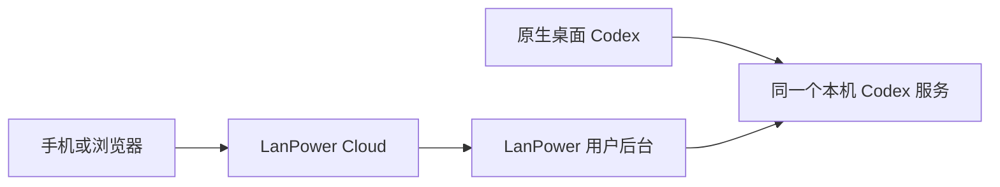

# Codex Remote 完整接管可行性

评估日期：2026-10-02。当前应用版本仍为 1.9.0；本次只补充架构评估，不修改程序、桌面 Codex 的运行配置或远程服务器。

## 为什么 1.9.0 不能控制桌面正在运行的任务

LanPower 的 `RuntimeClient` 启动了自己的 `codex app-server --listen stdio://`。桌面程序另外启动了 app-server。二者使用同一份 Codex Home，可以读取已保存的会话，但任务、工具进程、审批和活动任务编号由各自进程持有。读取历史不会连接到原进程；对第二个进程发送引导或中断，不能控制第一个进程正在执行的任务。

1.9.0 的桌面写锁检测只是防止重复恢复和操作正在被其他进程占用的会话。解除这项检查不会使两个进程共享任务。此前的“未提供共享端点”应理解为本机当前运行方式没有启用可供 LanPower 使用的共享端点，而非 Codex 在技术上无法提供此能力。

## 目前确认的依据

- 官方 app-server 文档提供 WebSocket、Unix socket、活动会话、状态通知、`turn/steer` 和 `turn/interrupt`。WebSocket 传输仍标记为实验性，不能直接视为经过生产验收的桌面接入方案。参考 [App Server](https://learn.chatgpt.com/docs/app-server)。
- 本机 CLI 0.159.0 提供 `app-server daemon`、`app-server proxy`、`remote-control`。官方 managed Remote 的配对流程与自建 LanPower Relay 是两套接入流程；执行官方配对命令不会自动把 LanPower 接到原生客户端。参考 [开发命令](https://learn.chatgpt.com/docs/developer-commands) 和 [Remote 连接](https://learn.chatgpt.com/docs/remote-connections)。
- 本机桌面包 26.928.1915.0 包含 `CODEX_APP_SERVER_WS_URL` / `websocket_url` 候选入口。其 `CODEX_APP_SERVER_USE_LOCAL_DAEMON` 分支明确排除 Windows。入口属于本机程序实现证据，尚未验证原生桌面连接自建共享服务后的完整行为，也不是官方承诺稳定的第三方接管接口。
- 在独立 Codex Home 和工作目录中启动带认证的本机 WebSocket 服务，两名独立客户端完成初始化，并通过 `thread/loaded/list` 看到同一个刚创建的内存会话。此检查没有登录文件、推理请求、项目文件修改，也没有重配或中断正在运行的桌面程序。空会话的第二客户端恢复请求被拒绝；这次验证仅证明共享连接和会话可见性，不证明实际运行任务已经可以被双端控制。

## 可行方向及必须补齐的工作

让桌面客户端与 LanPower 后台连接同一个本机 Codex 服务；Cloud 继续只转发经过本机授权的请求。先验证桌面候选入口、认证和原生功能兼容性，再确定是否能保留原生桌面作为日常入口。

共享连接还需要改造以下行为：按会话维护多个活动任务和真实状态；订阅同一任务的实时事件；审批由服务确认一次；连接断开后重新订阅而不重发任务；明确共享服务的生命周期，避免 LanPower 退出或关闭远程授权时结束桌面任务。现有“每 Runtime 一个活动任务”和“Host 退出就结束自有子进程”的处理不能直接套用到共享服务。

对于已经以独立 stdio 方式运行的桌面进程，外部客户端目前没有可连接的控制入口。切换到共享连接方式可能需要等待任务结束并重启桌面；不能把切换后的能力说成已能无缝接管当前运行中的旧进程。

## 完整接管的验收条件

1. 桌面创建并运行测试会话，Remote 识别同一会话及活动任务编号，实时收到输出和状态。
2. Remote 引导和暂停该任务，桌面显示同一任务实际接收引导、结束中断；没有启动另一份任务。
3. 两端对同一审批操作只生效一次，另一端及时显示已处理。
4. 两端可继续同一会话，切换项目、刷新和断线重连不会重复执行任务。
5. 本机授权与项目范围仍有效；退出 Remote 或撤销其授权不会意外终止桌面独立工作。

完成这些检查后，才能宣称具备同一会话的桌面与远程双端控制能力。目前结论是存在候选接入路径，完整原生桌面接管仍需实测。
