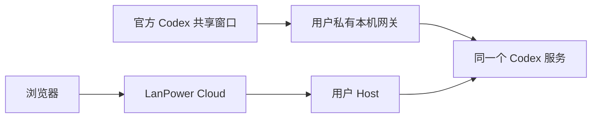

# Codex Remote 双端共享控制

2026-10-03，LanPower 1.13.1 已实现官方桌面与远程连接共用同一个本机 Codex 服务。当前测试版本为官方桌面 26.928.1915.0、CLI 0.159.0。

## 使用入口

在 LanPower Windows「远程连接」保存远程授权，再点击 **打开 Codex 双端控制**。该入口打开官方程序，使用独立界面配置并接入共享服务；Codex Home 和登录继续使用当前用户设置。在该窗口选择项目或会话，网页选择同一电脑和会话后，可以双端继续、引导和暂停，网页加入的原生队列也显示在桌面。

原有独立窗口的活动任务仍由自己的 stdio 服务持有，不能在线迁移。保留其工作，等任务完成并释放会话后，在共享窗口打开同一会话。不能通过删除锁文件或启动另一份任务获得活动任务控制。

## 1.13.1 修复

1. 共享服务准备就绪前的 WebSocket 连接失败改为可重试错误，避免首次启动直接退出。
2. 官方窗口显式进入 Codex 模式；安装缺失、连接超时和目录权限分别提示原因。
3. 已加载但尚无聊天记录的新会话补入列表；两种已确认的空历史错误允许读取和继续，其他订阅错误仍拒绝，运行中任务不套用此例外。
4. 切换共享模式等待旧远程任务、审批和后台命令结束，授权撤销仍立即生效。

## 已通过的真实检查

1. 在独立验收目录与界面配置中，用官方桌面 UI 创建并启动真实等待任务。
2. LanPower 产品 RemoteRuntime 连接同一服务，读到同一个活动编号，实际调用引导、原生排队和中断；官方 UI 显示队列和中断后的继续状态。
3. LanPower 产品连接创建真实任务，官方桌面按钮将它中断，产品连接回读确认状态为 interrupted。
4. 桌面发送的引导在另一实际连接的同一会话历史中确认；原生队列实际自动执行另行确认。远程连接断开后共享服务及桌面保持工作。
5. 实际产品共享服务通过当前用户命名管道返回认证连接，桌面网关不需要客户端 Bearer Header，两连接看到同一内存会话；浏览器 Origin 被拒绝。此项单独检查没有发送推理请求。

桌面任务检查使用真实官方程序、真实 Runtime 和 LanPower 产品连接，没有修改项目文件，没有重配或结束原有工作窗口。测试目录、界面截屏与临时认证文件只留在私有验收区，认证副本在检查结束后移除。

Windows 76 项、Cloud 200 项自动测试通过。共享 WebSocket 测试覆盖分片帧、活动编号恢复、越权目录拒绝、同一审批只生效一次和连接断开后保留任务。浏览器在 1440/390/320px 验证原生布局和旧模式，390px 额外检查共享控件、队列增删及旧中断事件不能覆盖新活动轮次。模拟审批和浏览器响应不计为真实原生审批 UI 或完整网页任务验收。

## 实现与安全范围

共享服务由独立用户进程持有，不放进 Host 的子进程生命周期。Host 退出、网页断开或撤销远程授权只断开远程连接。服务只绑定回环地址，后端使用随机认证 Token，用户管道及私有目录限制为当前用户；桌面网关另有随机入口并拒绝浏览器 Origin。安装器使用版本化共享服务目录，避免更新 Host 时结束桌面任务。

按会话维护活动任务与 Diff；订阅原生会话不覆盖其权限或模型。网页新建即时任务继续使用受限策略，原生队列沿用该会话设置。通知只转发已授权线程及有界界面内容，隐藏 reasoning 项不转发。

## 仍需验收的范围

本机 Docker 与 Windows 已更新到 1.13.1，原配置与设备身份保留。安装版实际按钮已通过 UI 自动化调用，确认共享窗口打开且设置保存。另用临时验收设备验证真实 Cloud → Windows Agent → 用户 Host → 产品共享服务 → 官方桌面：同一原生新会话可在网页打开，控件启用，刷新恢复及 390px 布局通过。官方客户端当前显示 Codex/Work 额度已用完，故本次完整网页任务引导、排队及暂停复测未完成；此前真实任务证据使用产品 Runtime 连接，不能算作本次完整网页按钮验收。还需用户在共享窗口进行日常项目、真实审批 UI、公网和微信真机验收；不宣称量化的 99% 相似度。

WebSocket 及桌面环境入口属于官方当前实现的实验性能力，原生队列接口由本机实验性 schema 与实际 RPC 验证。它们不是官方承诺稳定的第三方桌面接入接口，也不是 ChatGPT 托管 Remote 的配对服务。官方升级后需复核。参考 [官方 App Server](https://learn.chatgpt.com/docs/app-server)。
