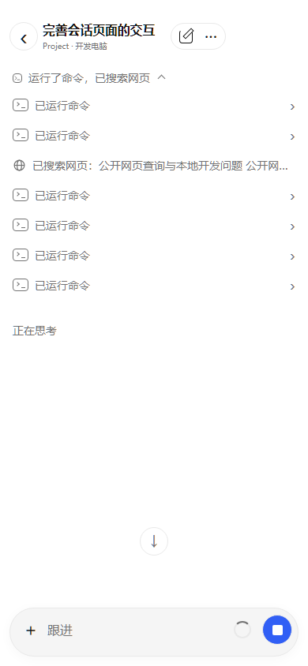
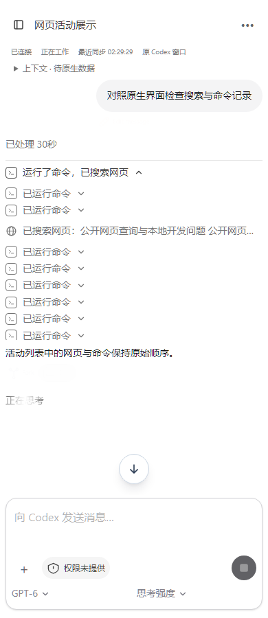
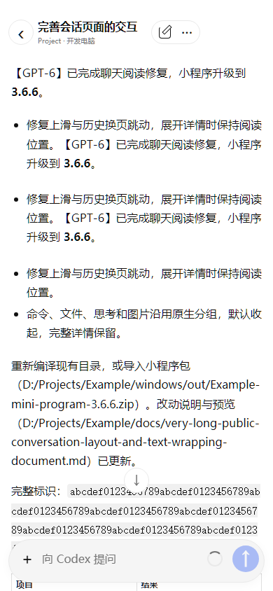

# 网页搜索与聊天阅读宽度（1.24.1 / 3.6.6）

日期：2026-10-06。Windows / Cloud / Web `1.24.1`，小程序 `3.6.6`，协议继续为 `2`。

网页与小程序按提供的原生 Codex 截图统一展示网络搜索。连续命令、文件与网页记录共同折叠为一条活动摘要，例如「运行了命令，已搜索网页」。展开后按原始顺序显示紧凑的终端行和地球图标网页行；长搜索词或网址单行省略，点击可阅读完整公开查询、网页操作及详情。列表有固定最大高度，可内部滚动。中间回复、公开思考、图片和回合边界继续隔开活动组，整轮完成后的工作过程折叠继续保留。

Web 原先使用独立的「网页搜索／输入／进行中／查看公开详情」卡片，小程序使用放大镜和独立的「正在搜索」记录。本次统一到同一份搜索状态与摘要处理，支持查询、多查询、打开网页和网页内查找。收到搜索开始与完成事件时直接更新单项状态；历史记录缺少状态时显示已搜索，已结束回合内残留的运行状态也会结束，明确的失败或停止仍显示原状态。不会因为整轮仍在工作而把已完成的网页全部标记为进行中。

小程序原聊天滚动组件直接设置水平内边距，而微信组件默认满宽，可能导致阅读区域超过屏幕，正文两侧被裁切。现在将内边距放到内部阅读容器，明确限制滚动与富文本宽度；富文本节点、长路径、行内代码、列表和表格在阅读区域内换行。正文及原始详情保留，修改只影响展示。

## 自动验证

- Web 95 项自动测试与类型检查通过，整套网页构建校验脚本、样式和 18 个组件标识匹配，避免混用构建。
- 小程序 32 项搜索、会话及 iOS 页面行为检查通过；原生页面、连接传输、队列、审批、长内容与电脑隔离检查通过。Cloud 客户端版本检查 9 项通过。
- 受控网页在 1440/390/320px 浅深色验证混合活动组、搜索开始与完成、刷新、整轮折叠、完整详情、单行省略和内部滚动；原输入栏、隐藏文件输入、命令详情及图片预览回归通过。
- 微信 WCC/WCSC 编译页面在 320/390/430px 验证活动列表、长中文、长路径、代码与表格的文字边界，以及放大字号和深色。采用微信满宽滚动组件规则，正文左右均不超出阅读区域。

页面回放使用虚构数据，没有向真实 Codex 发送推理任务。微信真机的原生富文本、嵌套触摸滚动、字体与 5G 仍待人工验收，编译后的浏览器适配检查不能替代真机。

## 合成页面预览

下图使用虚构会话数据。小程序图来自 WCC/WCSC 编译产物的浏览器适配器，不包含微信系统胶囊和真实触摸行为。

| 小程序活动组 | Web 活动组 |
| --- | --- |
|  |  |

## 本机更新与导入

本机 Docker、Windows 更新结果及数据保留证据见 [本机开发记录](local-development.md)。小程序重新编译完整 `mini_program`，或导入 `windows/out/CodexDock-mini-program-3.6.6.zip`。导入包根目录包含 `app.json`，使用占位 AppID 和重新生成的最小本机 HTTP 开发设置，不复制用户私有配置或授权。网页刷新 `http://localhost:8080/remote` 即可查看更新。

本轮只提交搜索展示、正文宽度、相关版本与文档；已有其他工作区改动保留。不推送远程仓库、不部署正式 Cloud。
