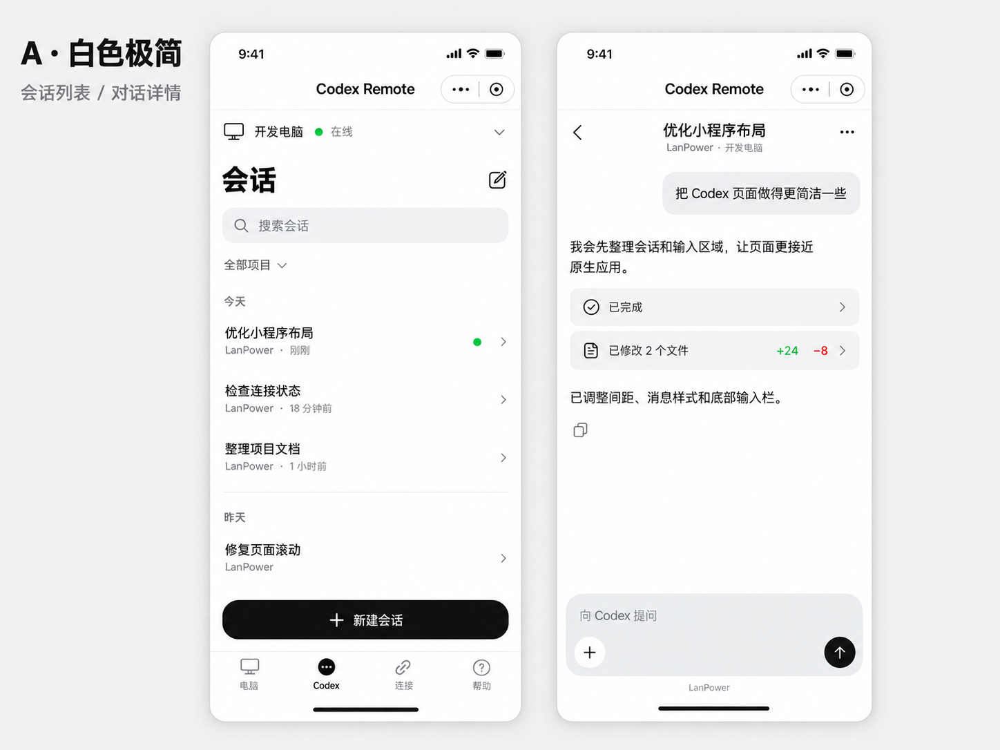
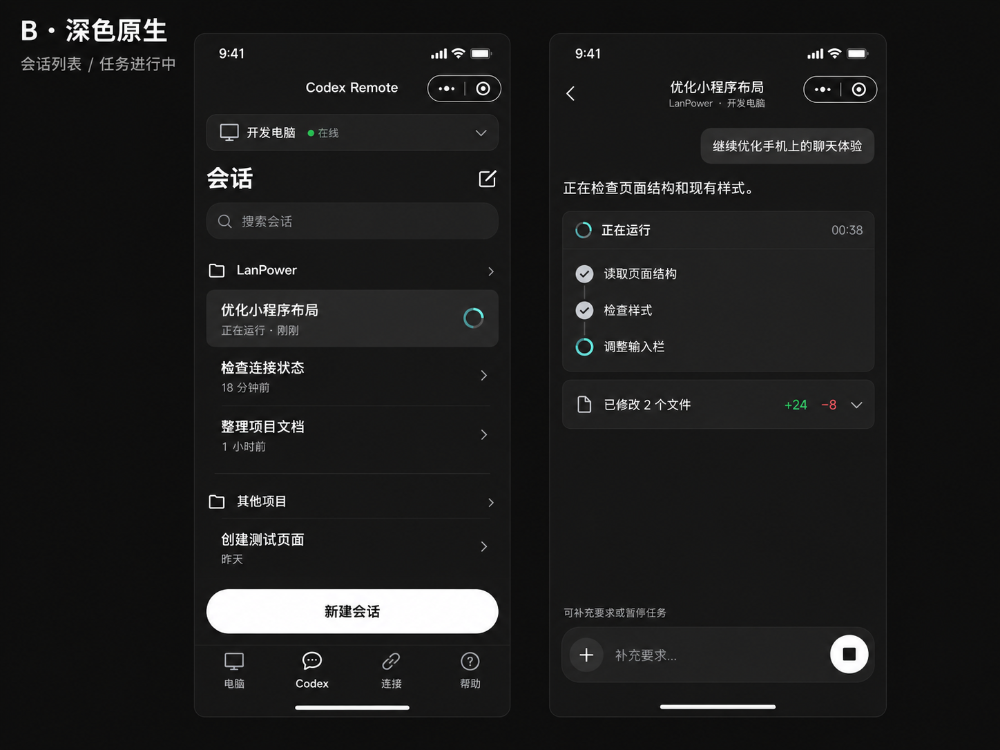
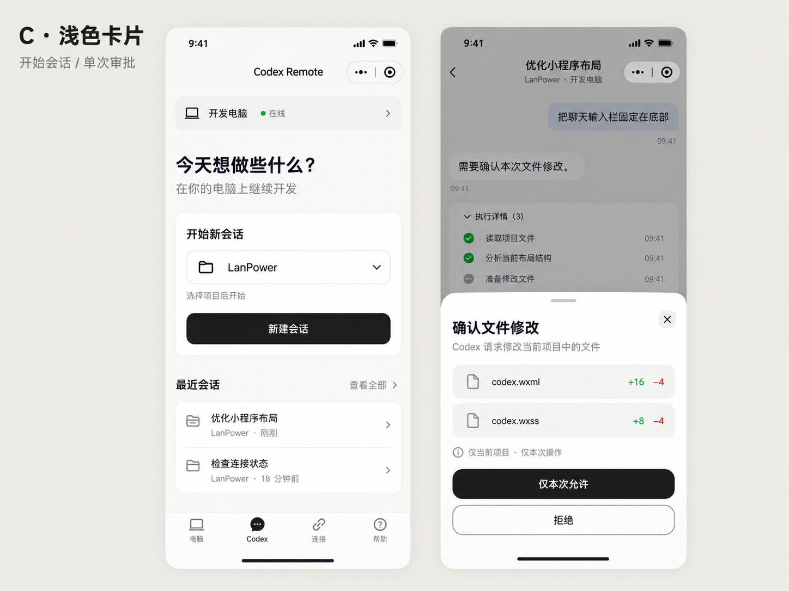

# Codex Remote 微信小程序效果图 v0.1

日期：2026-10-02。下一阶段开发重心转向微信小程序中的 Codex Remote 页面。本轮先生成三组视觉效果图，供选择接近 ChatGPT App 原生样式的方向。

本目录归档当时的设计预览，`v0.1` 为设计稿版本。后续小程序 `2.1.0` 已按 A 的白色界面、B 的深色模式和 C 的审批弹层实现第一版，实际界面与导入方法见 [第一版说明](../../codex-remote-mini-program.md)。

## 三组方向

| 方向 | 页面 | 主要特点 |
| --- | --- | --- |
| A · 白色极简 | 会话列表、对话详情 | 白底、浅灰用户气泡、直接排版的助手回复、黑色发送按钮；优先建议作为基础布局。 |
| B · 深色原生 | 会话列表、任务进行中 | 深色背景、清楚的执行步骤、文件修改摘要、暂停按钮；可沿 A 的结构发展为深色模式。 |
| C · 浅色卡片 | 开始会话、单次审批 | 项目选择和最近会话更突出，审批通过底部弹层展示；可将审批布局组合进 A 或 B。 |

### A · 白色极简

### B · 深色原生

### C · 浅色卡片

## 选定方向后保留的要点

- 保留微信小程序胶囊、顶部状态区和底部安全区；会话详情使用固定底部输入栏。
- 对话以内容和文字层级为主，执行过程和文件修改可展开查看。列表中的电脑、项目、会话和运行状态要容易辨认。
- 底部增加 Codex 入口是导航提案；现有电脑、连接、帮助功能在开发时继续保留。
- 文件审批显示涉及的文件及本次操作范围，提供“仅本次允许”和“拒绝”。图中的文件名、消息、耗时和修改数量均为示例。
- 沿用现有控制边界：Remote 创建或恢复的任务可引导、暂停；仍由桌面占用的会话按只读状态展示。效果图不代表已支持完整接管桌面正在运行的任务。

## 生成与检查

使用内置 imagegen 分别生成三张画板，每张包含两个手机页面，共六个页面示例。[完整生图提示词](prompts.md)随图片保存，便于选定方案后继续调整。

已查看三张图的中文、主要控件、微信胶囊和安全区，确认图片可以解码且本地归档与生成原图一致。生图用于视觉选择，具体字号、间距、键盘适配和触控区域仍需在实现后通过真实页面验证。

当前功能与权限边界见 [Codex Remote 使用与验收](../../codex-remote.md)；小程序当前功能见 [小程序说明](../../../mini_program/README.md)。
